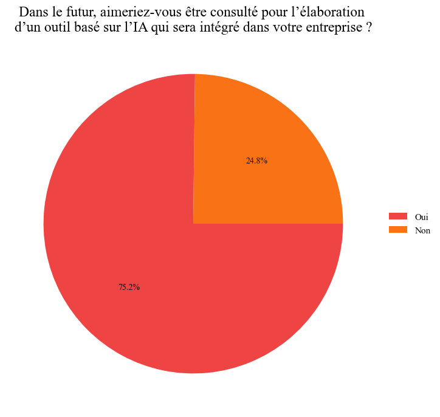

# AI ADOPTION BY EMPLOYEES (MEMOIRE PARIS1 IAE)

## Data

Pour ce faire, nous avons récolté les données à travers le sondage suivant (les réponses sont disponibles dans la section src/data) / To do this, we collected data through the following survey (the responses are available in the src/data section):
https://forms.gle/F6Dftsew5qZnBtKz9

---

### Rye

The project uses the Rye package for the notebook !

---

<html><head><meta content="text/html; charset=UTF-8" http-equiv="content-type"></head><body class="c37 c74 doc-content">

Kraut&nbsp;

<h1 class="c49 c21 c6" id="h.2et92p0">Remerciements</h1>

Nous tenons &agrave; remercier toutes les personnes qui nous ont apport&eacute; leur soutien pour la r&eacute;alisation de ce m&eacute;moire.

Tout d&#39;abord, merci &agrave; Monsieur Olivier CHRISTOFINI, directeur du MAE en formation initiale. Ses conseils&nbsp;et son accompagnement lors des diff&eacute;rentes s&eacute;ances, nous ont permis d&rsquo;appr&eacute;hender avec plus de s&eacute;r&eacute;nit&eacute; les particularit&eacute;s m&eacute;thodologiques inh&eacute;rentes &agrave; l&rsquo;exercice du m&eacute;moire.

Par ailleurs, nous souhaitons &eacute;galement adresser nos remerciements &agrave; l&rsquo;ensemble des professeurs de l&#39;IAE. Leurs enseignements nous ont permis d&#39;acqu&eacute;rir de solides connaissances et d&rsquo;affiner notre approche m&eacute;thodologique pour la production de ce m&eacute;moire. Leurs encouragements et leurs retours constructifs ont grandement enrichi cette exp&eacute;rience.

De plus, nous remercions toutes les personnes qui ont pris le temps de r&eacute;pondre &agrave; notre questionnaire en ligne. Leur contribution a &eacute;t&eacute; essentielle pour le d&eacute;veloppement de ce m&eacute;moire. Les r&eacute;ponses obtenues ont permis de mettre en avant des r&eacute;sultats significatifs et de d&eacute;velopper notre analyse du sujet.

Enfin, nous tenons &agrave; remercier nos familles et nos proches pour leur soutien, leurs encouragements et leur aide durant cette p&eacute;riode.

<h1 class="c49 c21 c6" id="h.tyjcwt">Abstract</h1>

Version fran&ccedil;aise

Ce m&eacute;moire &eacute;tudie le ph&eacute;nom&egrave;ne de r&eacute;sistance au changement associ&eacute;e &agrave; l&#39;int&eacute;gration de l&#39;intelligence artificielle (IA) dans des entreprises fran&ccedil;aises. &Agrave; travers une analyse approfondie de la litt&eacute;rature scientifique, il explore l&#39;&eacute;volution historique de la r&eacute;sistance aux innovations technologiques, mettant en lumi&egrave;re les r&eacute;actions contrast&eacute;es des individus et des organisations face au changement technologique. 

L&#39;av&egrave;nement de l&#39;IA, en tant que r&eacute;volution technologique majeure, a suscit&eacute; un int&eacute;r&ecirc;t croissant dans le milieu professionnel, mais a &eacute;galement g&eacute;n&eacute;r&eacute; des r&eacute;ticences. Pourtant, malgr&eacute; son importance croissante, la quantit&eacute; d&rsquo;articles scientifiques sur ce sujet reste relativement limit&eacute;e. Ce m&eacute;moire se penche donc sur le ph&eacute;nom&egrave;ne de r&eacute;sistance au changement li&eacute;e &agrave; l&#39;int&eacute;gration de l&#39;IA dans les entreprises en France, avec pour objectif d&#39;identifier les comportements r&eacute;fractaires et de proposer des strat&eacute;gies pour favoriser son adoption. Des hypoth&egrave;ses sont formul&eacute;es, mettant en &eacute;vidence l&#39;impact de variables telles que l&#39;&acirc;ge, la familiarit&eacute; avec l&#39;IA et la consultation des employ&eacute;s sur la r&eacute;sistance au changement. 

Pour &eacute;tudier l&rsquo;impact de ces facteurs, une &eacute;tude quantitative a &eacute;t&eacute; entreprise impliquant plus de 250 participants issus de divers secteurs professionnels. Ainsi, ce m&eacute;moire pr&eacute;sente les r&eacute;sultats de l&rsquo;&eacute;tude men&eacute;e, concluant que la r&eacute;sistance &agrave; l&rsquo;IA est plus faible qu&rsquo;attendue. Ces r&eacute;sultats indiquent aussi que l&rsquo;intensit&eacute; des craintes face &agrave; l&rsquo;IA varie selon la nature de la crainte et le profil du r&eacute;pondant. Les r&eacute;sultats montrent &eacute;galement que des solutions comme des formations ou l&rsquo;inclusion dans le processus d&#39;impl&eacute;mentation de l&rsquo;IA au travail favoriseraient son adoption. Enfin, la discussion, confrontant r&eacute;sultats et litt&eacute;rature, indique une actuelle transition entre la d&eacute;cision d&rsquo;adopter l&rsquo;IA et la phase de post-adoption. Contrairement &agrave; ce que montre la litt&eacute;rature, associant l&rsquo;exposition aux technologies &agrave; une augmentation des craintes en m&eacute;decine, les r&eacute;sultats indiquent que les craintes diminuent avec l&rsquo;exposition &agrave; l&rsquo;IA dans les domaines vari&eacute;s. Cela sugg&egrave;re une diff&eacute;rence entre la r&eacute;sistance &agrave; l&rsquo;IA et celle des technologies ant&eacute;rieures, les avantages de l&rsquo;IA surpassant ses inconv&eacute;nients. Enfin, la discussion souligne un retard dans l&rsquo;adoption de l&rsquo;IA dans des d&eacute;partements non op&eacute;rationnels.

Ce m&eacute;moire montre comment favoriser l&rsquo;int&eacute;gration de l&rsquo;IA, entre autres, au travers de formations et de processus de d&eacute;veloppement incluant les employ&eacute;s. 

Les limites de l&rsquo;&eacute;tude r&eacute;sident dans l&rsquo;aspect individuel du questionnaire et dans la cat&eacute;gorie socioprofessionnelle des r&eacute;pondants qui semblent &ecirc;tre majoritairement des cadres.

English version

This master&#39;s thesis studies the phenomenon of resistance to change associated with the integration of artificial intelligence (AI) in French companies. Through an in-depth analysis of the scientific literature, it explores the historical evolution of resistance to technological innovations, highlighting the contrasting reactions of individuals and organisations to technological change. 

The advent of AI, as a major technological revolution, has aroused growing interest in professional circles, but has also generated reticence. However, despite its growing importance, the number of scientific articles on this subject remains relatively limited. This dissertation therefore looks at the phenomenon of resistance to change linked to the integration of AI into companies in France, with the aim of identifying resistant behaviour and proposing strategies to encourage its adoption. Hypotheses are formulated, highlighting the impact of variables such as age, familiarity with AI and employee consultation on resistance to change. 

To investigate the impact of these factors, a quantitative study was undertaken involving over 200 participants from various professional sectors. This brief presents the results of the study, concluding that resistance to AI is lower than expected. The results also indicate that the intensity of fears about AI varies according to the nature of the fear and the profile of the respondent. The results also show that solutions such as training or inclusion in the process of implementing AI in the workplace would encourage its adoption. Finally, the discussion, comparing the results with the literature, indicates a current transition between the decision to adopt AI and the post-adoption phase. Unlike to what the literature shows, associating exposure to technologies with an increase in fears in medicine, the results indicate that fears decrease with exposure to AI in various fields. This suggests a difference between resistance to AI and that of previous technologies, with the benefits of AI outweighing its drawbacks. Finally, the discussion highlights a delay in AI adoption in non-operational departments.

This dissertation shows how AI integration can be fostered, among other things, through employee-inclusive training and development processes. 

The limitations of the study lie in the individual aspect of the questionnaire and in the socio-professional category of the respondents, who appear to be predominantly managers.

<h1 class="c49 c21 c6" id="h.3dy6vkm">Abr&eacute;viations</h1>

DOI&nbsp;&nbsp;&nbsp;&nbsp;&nbsp;&nbsp;&nbsp;&nbsp;&nbsp;&nbsp;&nbsp;&nbsp;&nbsp;&nbsp;&nbsp;&nbsp;Diffusion Of Innovations/Diffusion des Innovations

AI/IA&nbsp;&nbsp;&nbsp;&nbsp;&nbsp;&nbsp;&nbsp;&nbsp;&nbsp;&nbsp;&nbsp;&nbsp;&nbsp;&nbsp;&nbsp;&nbsp;Artficial Intelligence/Intelligence Artificielle

IC &nbsp;&nbsp;&nbsp;&nbsp;&nbsp;&nbsp;&nbsp;&nbsp;&nbsp;&nbsp;&nbsp;&nbsp;&nbsp;&nbsp;&nbsp;&nbsp;Intention Comportementale

IT/TI&nbsp;&nbsp;&nbsp;&nbsp;&nbsp;&nbsp;&nbsp;&nbsp;&nbsp;&nbsp;&nbsp;&nbsp;&nbsp;&nbsp;&nbsp;&nbsp;Information Technologie/Technologie de l&rsquo;Information

PI&nbsp;&nbsp;&nbsp;&nbsp;&nbsp;&nbsp;&nbsp;&nbsp;&nbsp;&nbsp;&nbsp;&nbsp;&nbsp;&nbsp;&nbsp;&nbsp;Personal Innovatioveness/ Capacit&eacute; d&rsquo;innovation personnelle

LLM&nbsp;&nbsp;&nbsp;&nbsp;&nbsp;&nbsp;&nbsp;&nbsp;&nbsp;&nbsp;&nbsp;&nbsp;&nbsp;&nbsp;&nbsp;&nbsp;Large Language Model/Mod&egrave;le massif de langage

PBC &nbsp;&nbsp;&nbsp;&nbsp;&nbsp;&nbsp;&nbsp;&nbsp;&nbsp;&nbsp;&nbsp;&nbsp;&nbsp;&nbsp;&nbsp;&nbsp;Perceived Behavioural Control/Contr&ocirc;le Comportemental Per&ccedil;u

TAM&nbsp;&nbsp;&nbsp;&nbsp;&nbsp;&nbsp;&nbsp;&nbsp;&nbsp;&nbsp;&nbsp;&nbsp;&nbsp;&nbsp;&nbsp;&nbsp;Technologie Acceptance Model/Mod&egrave;le d&rsquo;Acceptation de la Technologie

TIC&nbsp;&nbsp;&nbsp;&nbsp;&nbsp;&nbsp;&nbsp;&nbsp;&nbsp;&nbsp;&nbsp;&nbsp;&nbsp;&nbsp;&nbsp;&nbsp;Technologies de l&#39;Information et de la Communication

TPB &nbsp;&nbsp;&nbsp;&nbsp;&nbsp;&nbsp;&nbsp;&nbsp;&nbsp;&nbsp;&nbsp;&nbsp;&nbsp;&nbsp;&nbsp;&nbsp;Theory of Planned Behaviour/Th&eacute;orie du Comportement Planifi&eacute;

TRA &nbsp;&nbsp;&nbsp;&nbsp;&nbsp;&nbsp;&nbsp;&nbsp;&nbsp;&nbsp;&nbsp;&nbsp;&nbsp;&nbsp;&nbsp;&nbsp;Theory of Reasoned Action/Th&eacute;orie de l&rsquo;Action Raisonn&eacute;e

UTAUT&nbsp;&nbsp;&nbsp;&nbsp;&nbsp;&nbsp;&nbsp;&nbsp;Unified Theory of Acceptance and Use of Technologie/ 

Th&eacute;orie Unifi&eacute; de l&rsquo;Acception et de l&rsquo;Utilisation d&rsquo;une Technologie

Table des mati&egrave;res

<a class="c9" href="#h.2et92p0">Remerciements&nbsp;&nbsp;&nbsp;&nbsp;&nbsp;&nbsp;&nbsp;&nbsp;2</a>

<a class="c9" href="#h.tyjcwt">Abstract&nbsp;&nbsp;&nbsp;&nbsp;&nbsp;&nbsp;&nbsp;&nbsp;3</a>

<a class="c9" href="#h.3dy6vkm">Abr&eacute;viations&nbsp;&nbsp;&nbsp;&nbsp;&nbsp;&nbsp;&nbsp;&nbsp;5</a>

<a class="c9" href="#h.1t3h5sf">Table des figures&nbsp;&nbsp;&nbsp;&nbsp;&nbsp;&nbsp;&nbsp;&nbsp;7</a>

<a class="c9" href="#h.4d34og8">Introduction&nbsp;&nbsp;&nbsp;&nbsp;&nbsp;&nbsp;&nbsp;&nbsp;9</a>

<a class="c9" href="#h.2s8eyo1">Revue de litt&eacute;rature&nbsp;&nbsp;&nbsp;&nbsp;&nbsp;&nbsp;&nbsp;&nbsp;13</a>

<a class="c9" href="#h.17dp8vu">I - D&eacute;finition, fondements th&eacute;oriques et g&eacute;n&eacute;ralit&eacute;s&nbsp;&nbsp;&nbsp;&nbsp;&nbsp;&nbsp;&nbsp;&nbsp;13</a>

<a class="c9" href="#h.3rdcrjn">1.1 - D&eacute;finition&nbsp;&nbsp;&nbsp;&nbsp;&nbsp;&nbsp;&nbsp;&nbsp;13</a>

<a class="c9" href="#h.26in1rg">1.2 - Mod&egrave;les d&rsquo;analyse de la r&eacute;sistance au changement face &agrave; l&rsquo;impl&eacute;mentation d&rsquo;innovations technologique&nbsp;&nbsp;&nbsp;&nbsp;&nbsp;&nbsp;&nbsp;&nbsp;14</a>

<a class="c9" href="#h.3j2qqm3">II - &Eacute;tude pratique de la r&eacute;sistance au changement : analyse de situations r&eacute;elles&nbsp;&nbsp;&nbsp;&nbsp;&nbsp;&nbsp;&nbsp;&nbsp;21</a>

<a class="c9" href="#h.1y810tw">2.1 - La r&eacute;sistance au changement : un rapide &eacute;tat du point de vue des organisations&nbsp;&nbsp;&nbsp;&nbsp;&nbsp;&nbsp;&nbsp;&nbsp;21</a>

<a class="c9" href="#h.4i7ojhp">2.2 - La r&eacute;sistance au changement : une analyse du point de vue des individus&nbsp;&nbsp;&nbsp;&nbsp;&nbsp;&nbsp;&nbsp;&nbsp;21</a>

<a class="c9" href="#h.3whwml4">Contexte&nbsp;&nbsp;&nbsp;&nbsp;&nbsp;&nbsp;&nbsp;&nbsp;29</a>

<a class="c9" href="#h.qsh70q">R&eacute;sultats&nbsp;&nbsp;&nbsp;&nbsp;&nbsp;&nbsp;&nbsp;&nbsp;33</a>

<a class="c9" href="#h.3as4poj">I - Donn&eacute;es collect&eacute;es&nbsp;&nbsp;&nbsp;&nbsp;&nbsp;&nbsp;&nbsp;&nbsp;33</a>

<a class="c9" href="#h.1pxezwc">1.1- Premi&egrave;re partie : identification du profil du r&eacute;pondant&nbsp;&nbsp;&nbsp;&nbsp;&nbsp;&nbsp;&nbsp;&nbsp;33</a>

<a class="c9" href="#h.49x2ik5">1.2 - Seconde partie&nbsp;&nbsp;&nbsp;&nbsp;&nbsp;&nbsp;&nbsp;&nbsp;35</a>

<a class="c9" href="#h.2p2csry">II - Analyse des donn&eacute;es&nbsp;&nbsp;&nbsp;&nbsp;&nbsp;&nbsp;&nbsp;&nbsp;44</a>

<a class="c9" href="#h.147n2zr">2.1 - Familiarit&eacute;&nbsp;&nbsp;&nbsp;&nbsp;&nbsp;&nbsp;&nbsp;&nbsp;44</a>

<a class="c9" href="#h.23ckvvd">2.2 - Caract&egrave;re r&eacute;fractaire&nbsp;&nbsp;&nbsp;&nbsp;&nbsp;&nbsp;&nbsp;&nbsp;45</a>

<a class="c9" href="#h.41mghml">2.3 - Confiance&nbsp;&nbsp;&nbsp;&nbsp;&nbsp;&nbsp;&nbsp;&nbsp;47</a>

<a class="c9" href="#h.vx1227">2.4 - Craintes&nbsp;&nbsp;&nbsp;&nbsp;&nbsp;&nbsp;&nbsp;&nbsp;48</a>

<a class="c9" href="#h.19c6y18">2.5 - Int&eacute;r&ecirc;t pour cette nouvelle technologie&nbsp;&nbsp;&nbsp;&nbsp;&nbsp;&nbsp;&nbsp;&nbsp;52</a>

<a class="c9" href="#h.28h4qwu">Discussion&nbsp;&nbsp;&nbsp;&nbsp;&nbsp;&nbsp;&nbsp;&nbsp;54</a>

<a class="c9" href="#h.nmf14n">Bibliographie&nbsp;&nbsp;&nbsp;&nbsp;&nbsp;&nbsp;&nbsp;&nbsp;59</a>

<a class="c9" href="#h.nmf14n">Annexes&nbsp;&nbsp;&nbsp;&nbsp;&nbsp;&nbsp;&nbsp;&nbsp;61</a>

<h1 class="c49 c21 c6" id="h.1t3h5sf">Table des figures</h1>

<a class="c9" href="#h.206ipza">Figure 1 - Courbe du changement de K&uuml;bler-Ross&nbsp;&nbsp;&nbsp;&nbsp;&nbsp;&nbsp;&nbsp;&nbsp;12</a>

<a class="c9" href="#h.lnxbz9">Figure 2 - Mod&egrave;le TRA propos&eacute; par Fishbein et Ajzen (1975)&nbsp;&nbsp;&nbsp;&nbsp;&nbsp;&nbsp;&nbsp;&nbsp;16</a>

<a class="c9" href="#h.35nkun2">Figure 3 - Mod&egrave;le TAM propos&eacute; par Davis (1989)&nbsp;&nbsp;&nbsp;&nbsp;&nbsp;&nbsp;&nbsp;&nbsp;16</a>

<a class="c9" href="#h.1ksv4uv">Figure 4 - Mod&egrave;le TPB propos&eacute; par Ajzen (1991)&nbsp;&nbsp;&nbsp;&nbsp;&nbsp;&nbsp;&nbsp;&nbsp;17</a>

<a class="c9" href="#h.44sinio">Figure 5 - Mod&egrave;le conceptuel pour le processus d&rsquo;adoption des innovations en IT&nbsp;&nbsp;&nbsp;&nbsp;&nbsp;&nbsp;&nbsp;&nbsp;18</a>

<a class="c9" href="#h.2jxsxqh">Figure 6 - Cadre th&eacute;orique de l&#39;acceptation individuelle de l&#39;innovation dans les organisations&nbsp;&nbsp;&nbsp;&nbsp;&nbsp;&nbsp;&nbsp;&nbsp;18</a>

<a class="c9" href="#h.2xcytpi">Figure 7 - R&eacute;sistance &agrave; la mise en &oelig;uvre des technologies de l&#39;information : Une perspective longitudinale&nbsp;&nbsp;&nbsp;&nbsp;&nbsp;&nbsp;&nbsp;&nbsp;24</a>

<a class="c9" href="#h.1ci93xb">Figure 8 - Changement de niveau des comportements de r&eacute;sistance du groupe&nbsp;&nbsp;&nbsp;&nbsp;&nbsp;&nbsp;&nbsp;&nbsp;24</a>

<a class="c9" href="#h.2bn6wsx">Figure 9 - Int&eacute;gration de la &pound;pr&eacute;paration &agrave; l&#39;IA&pound; dans le processus d&#39;adoption de l&#39;IA par (J&ouml;hnk et al., 2021)&nbsp;&nbsp;&nbsp;&nbsp;&nbsp;&nbsp;&nbsp;&nbsp;29</a>

<a class="c9" href="#h.4k668n3">Figure 10 - R&eacute;partition par genre des r&eacute;pondants&nbsp;&nbsp;&nbsp;&nbsp;&nbsp;&nbsp;&nbsp;&nbsp;32</a>

<a class="c9" href="#h.2zbgiuw">Figure 11 - R&eacute;partition par &acirc;ge des r&eacute;pondants&nbsp;&nbsp;&nbsp;&nbsp;&nbsp;&nbsp;&nbsp;&nbsp;33</a>

<a class="c9" href="#h.1egqt2p">Figure 13 - R&eacute;partition par service des r&eacute;pondants&nbsp;&nbsp;&nbsp;&nbsp;&nbsp;&nbsp;&nbsp;&nbsp;33</a>

<a class="c9" href="#h.3ygebqi">Figure 12 - R&eacute;partition par secteur des r&eacute;pondants&nbsp;&nbsp;&nbsp;&nbsp;&nbsp;&nbsp;&nbsp;&nbsp;33</a>

<a class="c9" href="#h.2dlolyb">Figure 14 - Familiarit&eacute; avec l&#39;IA des r&eacute;pondants&nbsp;&nbsp;&nbsp;&nbsp;&nbsp;&nbsp;&nbsp;&nbsp;34</a>

<a class="c9" href="#h.sqyw64">Figure 15 - R&eacute;ticence des r&eacute;pondants &agrave; l&rsquo;utilisation de l&rsquo;IA au travail&nbsp;&nbsp;&nbsp;&nbsp;&nbsp;&nbsp;&nbsp;&nbsp;34</a>

<a class="c9" href="#h.3cqmetx">Figure 16 - R&eacute;ticence des r&eacute;pondants &agrave; l&#39;IA apr&egrave;s avoir lu le texte&nbsp;&nbsp;&nbsp;&nbsp;&nbsp;&nbsp;&nbsp;&nbsp;35</a>

<a class="c9" href="#h.1rvwp1q">Figure 17 - Outils utilis&eacute;s par les r&eacute;pondants&nbsp;&nbsp;&nbsp;&nbsp;&nbsp;&nbsp;&nbsp;&nbsp;35</a>

<a class="c9" href="#h.4bvk7pj">Figure 18 - Utilisation de l&#39;IA par les r&eacute;pondants&nbsp;&nbsp;&nbsp;&nbsp;&nbsp;&nbsp;&nbsp;&nbsp;35</a>

<a class="c9" href="#h.2r0uhxc">Figure 19 - Motivations des r&eacute;pondants &agrave; utiliser l&#39;IA&nbsp;&nbsp;&nbsp;&nbsp;&nbsp;&nbsp;&nbsp;&nbsp;36</a>

<a class="c9" href="#h.1664s55">Figure 20 - Probl&egrave;mes rencontr&eacute;s par les r&eacute;pondants en utilisant de l&#39;IA&nbsp;&nbsp;&nbsp;&nbsp;&nbsp;&nbsp;&nbsp;&nbsp;36</a>

<a class="c9" href="#h.3q5sasy">Figure 21 - Confiance des r&eacute;pondants dans les prises de d&eacute;cisions de l&rsquo;IA&nbsp;&nbsp;&nbsp;&nbsp;&nbsp;&nbsp;&nbsp;&nbsp;37</a>

<a class="c9" href="#h.25b2l0r">Figure 22 - Inqui&eacute;tudes des r&eacute;pondants dans l&#39;utilisation de l&#39;IA au travail&nbsp;&nbsp;&nbsp;&nbsp;&nbsp;&nbsp;&nbsp;&nbsp;37</a>

<a class="c9" href="#h.kgcv8k">Figure 23 &ndash; Peur d&rsquo;une perte d&#39;autonomie li&eacute;e &agrave; l&#39;IA&nbsp;&nbsp;&nbsp;&nbsp;&nbsp;&nbsp;&nbsp;&nbsp;38</a>

<a class="c9" href="#h.34g0dwd">Figure 24 &ndash; Peur d&rsquo;une r&eacute;duction des capacit&eacute;s de r&eacute;flexion li&eacute;es &agrave; l&#39;IA&nbsp;&nbsp;&nbsp;&nbsp;&nbsp;&nbsp;&nbsp;&nbsp;38</a>

<a class="c9" href="#h.1jlao46">Figure 25 - Peur de la perte d&#39;emploi li&eacute; &agrave; l&rsquo;IA&nbsp;&nbsp;&nbsp;&nbsp;&nbsp;&nbsp;&nbsp;&nbsp;39</a>

<a class="c9" href="#h.43ky6rz">Figure 26 - Inqui&eacute;tudes vis-&agrave;-vis de l&#39;arriv&eacute;e de l&#39;IA&nbsp;&nbsp;&nbsp;&nbsp;&nbsp;&nbsp;&nbsp;&nbsp;39</a>

<a class="c9" href="#h.2iq8gzs">Figure 27 - Inclusion des r&eacute;pondants dans des phases de d&eacute;veloppement d&#39;outils bas&eacute;s sur l&#39;IA&nbsp;&nbsp;&nbsp;&nbsp;&nbsp;&nbsp;&nbsp;&nbsp;40</a>

<a class="c9" href="#h.xvir7l">Figure 28 - Int&eacute;gration des r&eacute;pondants dans des processus bas&eacute;s sur l&#39;IA&nbsp;&nbsp;&nbsp;&nbsp;&nbsp;&nbsp;&nbsp;&nbsp;40</a>

<a class="c9" href="#h.3hv69ve">Figure 29 - Utilisation de l&#39;IA apr&egrave;s avoir &eacute;t&eacute; inclus dans un processus&nbsp;&nbsp;&nbsp;&nbsp;&nbsp;&nbsp;&nbsp;&nbsp;41</a>

<a class="c9" href="#h.1x0gk37">Figure 30 - R&eacute;pondants souhaitant suivre une formation pour mieux comprendre l&#39;IA&nbsp;&nbsp;&nbsp;&nbsp;&nbsp;&nbsp;&nbsp;&nbsp;41</a>

<a class="c9" href="#h.3o7alnk">Figure 31 - Familiarit&eacute; avec l&#39;IA par tranche d&#39;&acirc;ge&nbsp;&nbsp;&nbsp;&nbsp;&nbsp;&nbsp;&nbsp;&nbsp;43</a>

<a class="c9" href="#h.ihv636">Figure 32 - R&eacute;sistance &agrave; l&#39;IA par tranche d&#39;&acirc;ge&nbsp;&nbsp;&nbsp;&nbsp;&nbsp;&nbsp;&nbsp;&nbsp;44</a>

<a class="c9" href="#h.32hioqz">Figure 33 R&eacute;partition des r&eacute;pondants r&eacute;fractaires &agrave; l&#39;IA par secteur et par service&nbsp;&nbsp;&nbsp;&nbsp;&nbsp;&nbsp;&nbsp;&nbsp;45</a>

<a class="c9" href="#h.1hmsyys">Figure 34 - Suivi du caract&egrave;re r&eacute;fractaire des r&eacute;pondants avant/apr&egrave;s avoir lu le texte&nbsp;&nbsp;&nbsp;&nbsp;&nbsp;&nbsp;&nbsp;&nbsp;46</a>

<a class="c9" href="#h.2grqrue">Figure 35 - Confiance des r&eacute;pondants dans les d&eacute;cisions prises par des IA&nbsp;&nbsp;&nbsp;&nbsp;&nbsp;&nbsp;&nbsp;&nbsp;47</a>

<a class="c9" href="#h.3fwokq0">Figure 36 - Peur de la perte d&#39;autonomie des r&eacute;pondants par tranche d&#39;&acirc;ge&nbsp;&nbsp;&nbsp;&nbsp;&nbsp;&nbsp;&nbsp;&nbsp;48</a>

<a class="c9" href="#h.1v1yuxt">Figure 37 - Confiance des r&eacute;pondants dans les d&eacute;cisions prises par des IA en fonction de la peur de la perte d&#39;emploi&nbsp;&nbsp;&nbsp;&nbsp;&nbsp;&nbsp;&nbsp;&nbsp;49</a>

<a class="c9" href="#h.4f1mdlm">Figure 38 &ndash; R&eacute;partition des r&eacute;pondants qui apr&eacute;hendent une perte de leur emploi par secteur et par service&nbsp;&nbsp;&nbsp;&nbsp;&nbsp;&nbsp;&nbsp;&nbsp;50</a>

<a class="c9" href="#h.2u6wntf">Figure 39 - R&eacute;pondants ayant peur de perdre leurs capacit&eacute;s de r&eacute;flexions avec l&#39;IA par tranche d&#39;&acirc;ge&nbsp;&nbsp;&nbsp;&nbsp;&nbsp;&nbsp;&nbsp;&nbsp;51</a>

<a class="c9" href="#h.3tbugp1">Figure 40 &ndash; Implication des r&eacute;pondants dans le d&eacute;veloppement d&rsquo;outils bas&eacute;s sur l&rsquo;IA&nbsp;&nbsp;&nbsp;&nbsp;&nbsp;&nbsp;&nbsp;&nbsp;52</a>

<a class="c9" href="#h.4h042r0">Figure 41 - Adaptation fran&ccedil;aise du sch&eacute;ma de Davis, Bagozzi et Warshaw (1989)&nbsp;&nbsp;&nbsp;&nbsp;&nbsp;&nbsp;&nbsp;&nbsp;59</a>

<a class="c9" href="#h.37m2jsg">Figure 42 - Moyenne d&#39;utilisation de l&#39;IA par secteur et par service&nbsp;&nbsp;&nbsp;&nbsp;&nbsp;&nbsp;&nbsp;&nbsp;59</a>

<a class="c9" href="#h.1mrcu09">Figure 43 - Peur de perdre son emploi &agrave; cause de l&#39;IA par tranche d&#39;&acirc;ge&nbsp;&nbsp;&nbsp;&nbsp;&nbsp;&nbsp;&nbsp;&nbsp;60</a>

<a class="c9" href="#h.46r0co2">Figure 44 &ndash; Familiarit&eacute; des r&eacute;pondants avec l&#39;IA en fonction de leur implication dans le d&eacute;veloppement d&#39;outils bas&eacute;s sur l&#39;IA&nbsp;&nbsp;&nbsp;&nbsp;&nbsp;&nbsp;&nbsp;&nbsp;60</a>

<a class="c9" href="#h.2lwamvv">Figure 45 - Utilisation de l&#39;IA par les r&eacute;pondants par tranche d&#39;&acirc;ge&nbsp;&nbsp;&nbsp;&nbsp;&nbsp;&nbsp;&nbsp;&nbsp;61</a>

<a class="c9" href="#h.111kx3o">Figure 46 &ndash; Corr&eacute;lation entre l&rsquo;utilisation, la familiarit&eacute; et le nombre d&rsquo;outils utilis&eacute;s par les r&eacute;pondants&nbsp;&nbsp;&nbsp;&nbsp;&nbsp;&nbsp;&nbsp;&nbsp;61</a>

<a class="c9" href="#h.3l18frh">Figure 47 &ndash; R&eacute;partition des motivations des r&eacute;pondants en fonction de leur r&eacute;ticence vis-&agrave;-vis de l&rsquo;IA&nbsp;&nbsp;&nbsp;&nbsp;&nbsp;&nbsp;&nbsp;&nbsp;62</a>

<h1 class="c49 c21 c6" id="h.4d34og8">Introduction</h1>

&pound; Le progr&egrave;s ne vaut que s&rsquo;il est partag&eacute; par tous &pound;, affirmait Aristote. D&egrave;s l&#39;Antiquit&eacute;, des philosophes comme Aristote se sont int&eacute;ress&eacute;s &agrave; la r&eacute;sistance face aux innovations technologiques, soulignant les obstacles pos&eacute;s par la non-adh&eacute;sion de certaines personnes &agrave; leur utilisation. Cette opposition aux innovations technologiques se manifeste &agrave; travers les &acirc;ges, &agrave; chaque &eacute;mergence d&#39;une nouvelle technologie.

Les &pound;&nbsp;technological shifts&nbsp;&pound;, ou changements technologiques majeurs, ont jalonn&eacute; notre histoire. De la ma&icirc;trise du feu &agrave; la pr&eacute;histoire, en passant par la machine &agrave; vapeur de James Watt, jusqu&#39;aux machines de d&eacute;chiffrement d&eacute;velopp&eacute;es par Alan Turing, et plus tard le d&eacute;veloppement des premiers ordinateurs et l&#39;av&egrave;nement d&#39;Internet, les innovations technologiques ont toujours fait parler d&rsquo;elles. Chacune de ces avanc&eacute;es a &eacute;t&eacute; accompagn&eacute;e de r&eacute;sistances et d&#39;adh&eacute;sions, refl&eacute;tant les r&eacute;actions contrast&eacute;es des individus et des organisations face au changement technologique.

R&eacute;cemment, l&#39;&eacute;mergence de l&#39;intelligence artificielle (IA) a constitu&eacute; une r&eacute;volution technologique majeure, transformant de mani&egrave;re significative nos interactions quotidiennes avec la technologie. Les investissements massifs r&eacute;alis&eacute;s par les entreprises autour des ann&eacute;es 2017-2018 ont catalys&eacute; le d&eacute;veloppement de l&#39;IA, la propulsant de l&#39;&eacute;tat de concept &eacute;tudi&eacute; par les chercheurs &agrave; celui d&#39;outil accessible au grand public, notamment avec l&#39;av&egrave;nement de GPT-3.0. Cette avanc&eacute;e technologique a suscit&eacute; un vif int&eacute;r&ecirc;t dans le milieu professionnel, o&ugrave; les entreprises aspirent &agrave; int&eacute;grer l&#39;IA dans leurs processus de travail pour accro&icirc;tre leur productivit&eacute; et leur efficacit&eacute;. Cependant, cette expansion de l&#39;utilisation de l&#39;IA n&#39;est pas exempte de r&eacute;ticences, tant sur le plan professionnel que personnel. Toutefois, du fait de cette r&eacute;cente expansion, les articles abordant ce sujet demeurent peu nombreux. C&rsquo;est pourquoi nous concentrons ce m&eacute;moire sur le ph&eacute;nom&egrave;ne de r&eacute;sistance au changement associ&eacute; &agrave; l&#39;int&eacute;gration de l&#39;IA dans les entreprises en France, ainsi que sur les strat&eacute;gies pouvant &ecirc;tre d&eacute;ploy&eacute;es pour faciliter cette int&eacute;gration. En nous appuyant sur les &eacute;crits de la litt&eacute;rature scientifique relatant certains de ces &eacute;pisodes historiques, ainsi que sur les &eacute;tudes portant sur la r&eacute;sistance au changement, nous &eacute;tablirons les fondements n&eacute;cessaires &agrave; l&#39;analyse de notre sujet. 

Nous &eacute;tudierons ainsi le probl&egrave;me suivant : 

Comment favoriser l&rsquo;adoption de l&rsquo;IA dans les entreprises fran&ccedil;aises face &agrave; une r&eacute;sistance au changement naissante ? 

L&rsquo;objectif de la recherche effectu&eacute;e dans le cadre de notre m&eacute;moire est de mieux appr&eacute;hender les comportements des individus face &agrave; l&rsquo;int&eacute;gration de l&rsquo;IA dans le contexte professionnel et notamment de mieux identifier et comprendre les comportements r&eacute;fractaires afin de proposer des solutions aux managers pour favoriser son adoption.

L&#39;int&eacute;gration de l&#39;IA en entreprise rencontre diverses r&eacute;sistances, influenc&eacute;es par plusieurs facteurs. Premi&egrave;rement, il nous semble que l&#39;&acirc;ge, le genre, la familiarit&eacute; avec l&#39;IA, le secteur d&#39;activit&eacute; et le service occup&eacute; sont des variables d&eacute;terminantes dans la r&eacute;sistance au changement technologique. En outre, les comportements de r&eacute;sistance &agrave; l&#39;IA semblent souvent li&eacute;s &agrave; des peurs sp&eacute;cifiques, telles que la crainte de perdre son emploi, de voir ses comp&eacute;tences professionnelles devenir obsol&egrave;tes, ou de perdre en autonomie. Une autre hypoth&egrave;se avanc&eacute;e est que l&#39;inclusion ou la consultation des employ&eacute;s lors de la mise en &oelig;uvre de l&#39;IA pourrait r&eacute;duire leur r&eacute;sistance au changement, favorisant ainsi une meilleure acceptation de cette technologie. Enfin, la formation des employ&eacute;s &agrave; l&#39;IA est &eacute;galement suppos&eacute;e diminuer les comportements de r&eacute;sistance, en les rendant plus comp&eacute;tents et confiants dans l&#39;utilisation de cette nouvelle technologie. Ainsi, nous nous appuyons sur ces hypoth&egrave;ses, que nous testons au cours de notre &eacute;tude afin de les confirmer ou de les invalider.

Dans le cadre de notre exercice, nous r&eacute;alisons une &eacute;tude quantitative dans le but d&#39;obtenir des donn&eacute;es quantifiables et mesurables. Pour ce faire, apr&egrave;s avoir segment&eacute; la population de r&eacute;pondants &agrave; l&#39;aide de quelques questions introductives fond&eacute;es sur nos hypoth&egrave;ses, elles-m&ecirc;mes influenc&eacute;es par la lecture d&rsquo;articles issus de la litt&eacute;rature scientifique, nous interrogeons les participants sur leur r&eacute;ticence face &agrave; l&#39;IA. Par la suite, nous pr&eacute;sentons au travers d&rsquo;un texte, l&#39;IA et des exemples applications, avant de poser &agrave; nouveau une question sur leur attitude r&eacute;fractaire. Enfin, les derni&egrave;res questions du sondage abordent quant &agrave; elles la familiarit&eacute; qu&rsquo;ont les r&eacute;pondants avec l&#39;IA, ainsi que leurs appr&eacute;hensions li&eacute;es &agrave; son int&eacute;gration dans les entreprises et leurs r&eacute;actions face &agrave; certaines mesures mises en place pour favoriser son adoption. Le questionnaire diffus&eacute; au travers de divers canaux, vise &agrave; recueillir les r&eacute;ponses de plus de 250 participants.

Ainsi, ce m&eacute;moire est structur&eacute; de la mani&egrave;re suivante. Nous commen&ccedil;ons par explorer la litt&eacute;rature scientifique et les concepts fondamentaux relatifs &agrave; la r&eacute;sistance au changement et aux r&eacute;actions face aux nouvelles technologies. Sur cette base, nous d&eacute;finissons notre contexte d&#39;&eacute;tude et explicitons nos hypoth&egrave;ses, afin de mener l&rsquo;&eacute;tude pr&eacute;c&eacute;demment pr&eacute;sent&eacute;e.

Les donn&eacute;es collect&eacute;es sont d&#39;abord pr&eacute;sent&eacute;es de mani&egrave;re brute, puis retrait&eacute;es pour &ecirc;tre analys&eacute;es et discut&eacute;es. Enfin, en confrontant nos r&eacute;sultats &agrave; la litt&eacute;rature existante, nous exposons plus en d&eacute;tail les conclusions majeures auxquels nous a conduits ce m&eacute;moire dont voici un r&eacute;sum&eacute; : 

Contrairement &agrave; nos attentes initiales bas&eacute;es sur les constats de revues de litt&eacute;rature et les &pound;bruits de couloirs&pound; de nos diff&eacute;rentes entreprises, le nombre de personnes r&eacute;fractaires parmi les r&eacute;pondants est assez faible (&agrave; peine plus de 10%). Toutefois, ce chiffre reste assez cons&eacute;quent pour rendre l&rsquo;&eacute;tude de la r&eacute;sistance au changement pertinente, d&rsquo;autant plus qu&rsquo;en raison de la diffusion du sondage dans nos entreprises respectives, la population l&rsquo;ayant re&ccedil;ue est principalement une population de jeunes cadres peu concern&eacute;s par des t&acirc;ches r&eacute;p&eacute;titives ou administratives. M&ecirc;me s&rsquo;ils doivent &ecirc;tre lus en ayant &agrave; l&rsquo;esprit cette limite, nos r&eacute;sultats mettent en avant une certaine corr&eacute;lation entre l&#39;&acirc;ge des individus et leur familiarit&eacute; avec l&#39;IA, sugg&eacute;rant que la r&eacute;sistance &agrave; l&#39;adoption de cette technologie augmente avec l&rsquo;&acirc;ge. Les jeunes adultes paraissent plus enclins &agrave; adopter l&#39;IA et &agrave; s&#39;y adapter, tandis que les individus plus &acirc;g&eacute;s sont davantage r&eacute;ticents. Le niveau de confiance que les individus ont vis-&agrave;-vis des d&eacute;cisions prises par l&rsquo;IA est positivement corr&eacute;l&eacute; &agrave; leur familiarit&eacute; avec celle-ci. Le manque de familiarit&eacute; quant &agrave; lui semble alimenter les craintes li&eacute;es &agrave; la perte d&rsquo;emploi ou d&rsquo;autonomie.

En effet, ces trois craintes : perte d&#39;autonomie, perte des capacit&eacute;s de r&eacute;flexion et perte d&rsquo;emploi sont toutes existantes, mais ressenties par une minorit&eacute; de r&eacute;pondants. Toutefois, cette minorit&eacute; est non n&eacute;gligeable, car elle est sup&eacute;rieure &agrave; 10%.

Le caract&egrave;re r&eacute;fractaire &agrave; l&#39;int&eacute;gration de l&rsquo;IA ainsi que la crainte de perdre son emploi &agrave; cause de cette derni&egrave;re varient tous les deux en fonction du secteur et du service. Par exemple, les personnes occupant des services administratifs semblent moins favorables &agrave; l&rsquo;arriv&eacute;e de l&rsquo;IA au travail et ressentent plus de craintes &agrave; son encontre.

Pour faire face &agrave; cette minorit&eacute; r&eacute;fractaire, l&rsquo;accompagnement et l&#39;&eacute;coute des employ&eacute;s, ainsi que la mise en place d&rsquo;un plan d&rsquo;&eacute;veil &agrave; cette technologie et de formations semblent &ecirc;tre la clef. Cependant, des cas aux limites persistent, nous amenant &agrave; nous r&eacute;interroger sur le m&eacute;canisme d&rsquo;acceptation de cette technologie.

Effectivement, la confrontation entre nos r&eacute;sultats et la litt&eacute;rature &eacute;tudi&eacute;e m&egrave;ne &agrave; plusieurs constats.

Premi&egrave;rement, il semble que nous soyons aujourd&rsquo;hui dans la phase de transition, entre la d&eacute;cision d&#39;adopter l&rsquo;IA et la phase de post-adoption. En effet, le nombre d&rsquo;individus affirmant utiliser l&rsquo;IA au travail est sup&eacute;rieur au seuil de bascule qui est d&eacute;fini dans la litt&eacute;rature comme l&rsquo;&eacute;tape &agrave; partir de laquelle la transformation s&rsquo;acc&eacute;l&egrave;re, alors qu&rsquo;il &eacute;tait en dessous, il y a encore quelques ann&eacute;es.

Ensuite, m&ecirc;me si la litt&eacute;rature montre que les craintes, s&rsquo;intensifient avec l&rsquo;exposition &agrave; un outil technologique dans le domaine m&eacute;dical, nos r&eacute;sultats montrent qu&rsquo;elles s&#39;amoindrissent avec une exposition &agrave; l&rsquo;IA &agrave; une &eacute;chelle globale. Ainsi, dans le cas o&ugrave; l&rsquo;IA semble &ecirc;tre une technologie plus facilement accept&eacute;e que ses pr&eacute;d&eacute;cesseurs, il se pourrait que la r&eacute;sistance &agrave; l&rsquo;IA soit diff&eacute;rente de la r&eacute;sistance aux innovations l&rsquo;ayant pr&eacute;c&eacute;d&eacute;e. Cette diff&eacute;rence entre l&rsquo;IA et les autres technologies pourrait s&rsquo;expliquer par le rapport avantages/risques. Les gains esp&eacute;r&eacute;s en adoptant l&rsquo;IA, agissant comme des facilitateurs, sont sup&eacute;rieurs aux menaces, qui sont des inhibiteurs. Le dessus &eacute;tant pris par les facilitateurs, l&rsquo;IA est plus facilement accept&eacute;e.

Enfin, la confrontation entre nos r&eacute;sultats et la litt&eacute;rature sugg&egrave;re que certains d&eacute;partements non op&eacute;rationnels accusent un retard surprenant au vu des possibilit&eacute;s offertes par l&#39;IA. Cela amenant &agrave; penser que des conditions, telles que la concurrence, ont moins d&#39;impact sur les fonctions supports, o&ugrave; l&#39;adoption des innovations y suit un rythme plus lent.

En lien avec nos r&eacute;sultats et les constats ci-dessus, nous &eacute;tudions comment favoriser l&rsquo;adoption de l&rsquo;IA. 

Premi&egrave;rement, et l&agrave; o&ugrave; les r&eacute;sultats du test ne montrent aucun doute, il nous semble qu&rsquo;inclure les employ&eacute;s dans le choix des processus de mise en place de l&rsquo;IA les rend plus favorable &agrave; son adoption. 

Enfin, en dehors de notre environnement majoritairement constitu&eacute; de cadres, notre &eacute;tude pr&eacute;sente une autre limite : le questionnaire est r&eacute;alis&eacute; au niveau individuel et non organisationnel. Ce choix de questionnaire nous a permis d&#39;&eacute;tudier de pr&egrave;s les comportements de r&eacute;sistance de l&rsquo;individu face &agrave; l&#39;impl&eacute;mentation de l&rsquo;IA et d&#39;apporter des &eacute;l&eacute;ments de r&eacute;ponse. Toutefois, il faut bien garder &agrave; l&rsquo;esprit que la r&eacute;sistance au changement est &eacute;galement une affaire de groupe, ce que nous avons rapidement explicit&eacute; dans la revue de litt&eacute;rature et le contexte.

<h1 class="c49 c21 c6" id="h.2s8eyo1">Revue de litt&eacute;rature</h1>

Toute organisation est amen&eacute;e &agrave; &ecirc;tre confront&eacute;e au changement. Que ce soit pour s&rsquo;adapter &agrave; son environnement externe, &agrave; son contexte interne ou encore pour accro&icirc;tre ses performances, l&rsquo;organisation se transforme. Pourtant, m&ecirc;me si un changement entrepris par la direction est mis en place dans l&rsquo;int&eacute;r&ecirc;t de l&rsquo;entreprise, il n&rsquo;est pas toujours accept&eacute; par les employ&eacute;s. On observe alors, un comportement de r&eacute;sistance au changement.

<h2 class="c80 c21 c6" id="h.17dp8vu">I - D&eacute;finition, fondements th&eacute;oriques et g&eacute;n&eacute;ralit&eacute;s</h2><h3 class="c5 c23 c6" id="h.3rdcrjn">1.1 - D&eacute;finition</h3>
Introduite par K. Lewin puis &eacute;largie par bien d&rsquo;autres comme M. Crozier et E. Friedberg tel que d&eacute;crit dans le livre &pound;&nbsp;Comportements humains et management&pound; de F. Alexandre-Bailly (Alexandre-Bailly et al., 2022), la r&eacute;sistance au changement qualifie tout comportement d&rsquo;opposition, conscient ou non, exerc&eacute; par un individu ou un groupe face &agrave; un changement.

Au sein de l&rsquo;organisation, la r&eacute;sistance au changement peut perturber, voire faire &eacute;chouer, la mise en &oelig;uvre du changement organisationnel.

De nombreux auteurs ont mis en exergue l&rsquo;importance du temps dans l&rsquo;&eacute;volution de la r&eacute;sistance au changement. C&rsquo;est notamment le cas de Kurt Lewin dans &#39;Field Theory in Social Science&#39;, (Lewin, 1951) qui d&eacute;crit trois &eacute;tapes par lesquelles le groupe passe pendant le processus de changement :
<ul class="c7 lst-kix_list_7-0 start"><li class="c10 c35 li-bullet-0">la d&eacute;cristallisation, durant laquelle on modifie progressivement les habitudes initiales du groupe et on cherche &agrave; diminuer les forces qui s&rsquo;opposent au changement,</li><li class="c10 c35 li-bullet-0">le mouvement, qui consiste &agrave; passer des forces de r&eacute;sistance au changement vers les forces motrices au changement en d&eacute;finissant un nouvel objectif,</li><li class="c5 c35 li-bullet-0">la recristallisation, qui est constitu&eacute;e du renforcement et de la stabilisation du nouvel &eacute;tat atteint.</li></ul>
Le facteur temps est &eacute;galement &eacute;tudi&eacute; par K&uuml;bler-Ross qui s&rsquo;est pench&eacute; sur le processus de changement v&eacute;cu par l&rsquo;individu.

Selon K&uuml;bler-Ross, l&rsquo;individu vit le changement comme un deuil et doit &ecirc;tre accompagn&eacute; par l&rsquo;entreprise d&rsquo;une mani&egrave;re adapt&eacute;e selon l&rsquo;&eacute;tape de deuil v&eacute;cue. Il est important d&rsquo;ajouter que chaque individu vit le processus de changement plus ou moins rapidement.

De plus, le changement touche les trois sph&egrave;res fondamentales de l&rsquo;entreprise : les dispositifs organisationnels, la culture et les strat&eacute;gies d&rsquo;acteurs (Alexandre-Bailly et al., 2022). La r&eacute;sistance au changement sera plus ou moins importante en fonction de la fa&ccedil;on dont le changement organisationnel heurte ces trois sph&egrave;res.

Ainsi, la r&eacute;sistance au changement est un ph&eacute;nom&egrave;ne courant au sein de l&rsquo;organisation, pr&eacute;sente pour divers types de changement et anim&eacute;e par un m&eacute;canisme complexe m&ecirc;lant l&rsquo;individu, le groupe, les sph&egrave;res de l&rsquo;organisation et le temps. Mais qu&rsquo;en est-il de la r&eacute;sistance au changement face &agrave; l&rsquo;int&eacute;gration de nouvelles technologies au sein de l&rsquo;entreprise ? On trouve divers travaux qui se sont pench&eacute;s sur cette question et l&rsquo;ont &eacute;tudi&eacute;e sous diverses coutures.

<h3 class="c5 c23 c6" id="h.26in1rg">1.2 - Mod&egrave;les d&rsquo;analyse de la r&eacute;sistance au changement face &agrave; l&rsquo;impl&eacute;mentation d&rsquo;innovations technologique</h3>
Il ne faut pas confondre r&eacute;sistance au changement et rejet. En effet, selon Sven Laumer dans un article &pound;Why do people reject technology&pound; (Laumer and Eckhardt, 2012), la r&eacute;sistance est une action, la personne empreinte de r&eacute;sistance est donc active, tandis que dans le cas d&rsquo;un rejet qui est d&eacute;fini comme un refus d&rsquo;accepter, la personne est passive. Il existe aussi diff&eacute;rents types de rejet (rejet complet, rejet partiel, r&eacute;sistance active, acceptation contre son gr&eacute; et acceptation totale) qu&rsquo;il convient de distinguer. Dans son &eacute;tude, S.Laumer reprend divers mod&egrave;les de la th&eacute;orie qui permettent d&rsquo;analyser la r&eacute;sistance au changement (Laumer and Eckhardt, 2012) : 
<ul class="c7 lst-kix_list_15-0 start"><li class="c16 c21 c35 li-bullet-0">Mod&egrave;le multi-niveaux de r&eacute;sistance &agrave; l&#39;implantation des technologies de l&#39;information (Lapointe and Rivard, 2005)&nbsp;:</li></ul>

Lapointe et Rivard (2005) proposent un mod&egrave;le de r&eacute;sistance &agrave; la mise en &oelig;uvre des technologies de l&#39;information dans lequel les comportements de r&eacute;sistance surviennent &agrave; la suite de menaces per&ccedil;ues qui r&eacute;sultent de l&#39;interaction entre les conditions initiales et un objet donn&eacute;. Ils observent la pr&eacute;sence de d&eacute;terminants mixtes (par exemple, les conditions initiales, les caract&eacute;ristiques du syst&egrave;me) des comportements de r&eacute;sistance, tant au niveau individuel qu&#39;au niveau de l&#39;unit&eacute;, mais aussi du temps &agrave; l&rsquo;instar de K&uuml;bler Ross. Ces d&eacute;terminants influencent les comportements de r&eacute;sistance.

En effet, dans leur article intitul&eacute; &pound;&nbsp;A Multilevel Model of Resistance to Information Technology Implementation&nbsp;&pound;, les mod&egrave;les de r&eacute;sistances au changement existants ont des limites, notamment, car ils ne prennent pas explicitement en compte le r&ocirc;le du temps dans le d&eacute;ploiement de la r&eacute;sistance. Cela d&rsquo;autant plus que le processus de mise en &oelig;uvre des technologies de l&rsquo;information (objet de cet article) n&rsquo;est pas instantan&eacute; et la r&eacute;sistance peut &eacute;voluer avec le temps. De plus, selon eux, certains mod&egrave;les se focalisent sur les comportements de groupe, alors que la r&eacute;sistance au changement se passe aussi au niveau individuel. Dans ce cadre-l&agrave;, les auteurs ont r&eacute;alis&eacute; une analyse s&eacute;mantique pour diff&eacute;rencier les &eacute;l&eacute;ments communs aux diff&eacute;rentes d&eacute;finitions de r&eacute;sistance au changement&nbsp;et qui constituent donc les composantes fondamentales de cette derni&egrave;re&nbsp;: 
<ul class="c7 lst-kix_list_3-0 start"><li class="c8 li-bullet-0">Comportements de r&eacute;sistance :&nbsp;cela englobe un spectre de comportements allant du manque de coop&eacute;ration passive aux actions agressives, telles que le sabotage ou les gr&egrave;ves.</li><li class="c8 li-bullet-0">Objet de r&eacute;sistance :&nbsp;cela fait r&eacute;f&eacute;rence &agrave; ce &agrave; quoi on r&eacute;siste, qu&#39;il s&#39;agisse de changements de gestion, de nouvelles technologies ou de changements dans les pratiques organisationnelles.</li><li class="c8 li-bullet-0">Menaces per&ccedil;ues :&nbsp;la r&eacute;sistance surgit souvent en r&eacute;ponse &agrave; des menaces per&ccedil;ues, qu&#39;elles impliquent une perte de statut, de pouvoir ou d&#39;autres cons&eacute;quences n&eacute;fastes.</li><li class="c8 li-bullet-0">Conditions initiales :&nbsp;des facteurs tels que la dynamique du pouvoir, les routines &eacute;tablies ou la r&eacute;partition des ressources peuvent influencer la fa&ccedil;on dont l&#39;objet de la r&eacute;sistance est per&ccedil;u comme mena&ccedil;ant.</li><li class="c5 c15 li-bullet-0">Sujet de r&eacute;sistance :&nbsp;il s&#39;agit de l&#39;entit&eacute; qui adopte des comportements de r&eacute;sistance, qui peut &ecirc;tre des individus, des groupes ou des organisations enti&egrave;res, selon le contexte.</li></ul>

<ul class="c7 lst-kix_list_15-0"><li class="c16 c21 c35 li-bullet-0">Deuxi&egrave;me mod&egrave;le pr&eacute;sent&eacute; par S. Laumer : Pouvoir, politique et mise en &oelig;uvre du SIG (Markus, 1983)&nbsp;:</li></ul>

Markus (1983) explique la r&eacute;sistance en termes d&#39;interaction entre le syst&egrave;me mis en &oelig;uvre et le contexte d&#39;utilisation et postule qu&#39;un groupe d&#39;acteurs sera enclin &agrave; utiliser un syst&egrave;me s&#39;il pense qu&#39;il soutiendra sa position de pouvoir. Si un utilisateur pense que le syst&egrave;me risque de lui faire perdre son pouvoir, il r&eacute;sistera.

<ul class="c7 lst-kix_list_15-0"><li class="c16 c21 c35 li-bullet-0">Les inhibiteurs et les facilitateurs en tant que concepts &agrave; double facteur dans l&#39;utilisation de la technologie (University of British Columbia, Canada and Cenfetelli, 2004)&nbsp;:</li></ul>

Cenfetelli propose une th&eacute;orie sur l&#39;existence, la nature et les effets des perceptions des attributs d&#39;un syst&egrave;me qui ont pour seul effet de d&eacute;courager l&#39;utilisation. Les inhibiteurs de l&#39;utilisation d&#39;un syst&egrave;me sont des perceptions des attributs du syst&egrave;me. Les inhibiteurs sont qualitativement uniques par rapport &agrave; la vaste gamme de croyances orient&eacute;es positivement que l&#39;on trouve dans la litt&eacute;rature sur la satisfaction de l&#39;utilisateur. Ils agissent uniquement pour d&eacute;courager l&#39;utilisation, mais leur absence n&#39;encourage pas leur application. Ces croyances inhibitrices sont ind&eacute;pendantes des croyances favorables et peuvent donc coexister avec ces derni&egrave;res et avoir des ant&eacute;c&eacute;dents et des effets cons&eacute;quents diff&eacute;rents.

<ul class="c7 lst-kix_list_15-0"><li class="c16 c21 c35 li-bullet-0">Analyse de l&#39;in&#64258;uence sociale des r&eacute;f&eacute;rents du lieu de travail sur les technologies de l&#39;information et leur non-adoption (Eckhardt et al., 2009)&nbsp;:</li></ul>
(Eckhardt et al., 2009) appliquent l&rsquo;UTAUT (Unified Theory of Acceptance and Use of Technology) pour identifier les diff&eacute;rentes sources d&#39;in&#64258;uence sociale pour les adoptants et les non-adoptants. Ils constatent un impact significatif de l&#39;in&#64258;uence sociale des individus des m&ecirc;mes op&eacute;rations (focales) et du m&ecirc;me d&eacute;partement informatique sur la non-adoption des technologies de l&#39;information.

<ul class="c7 lst-kix_list_15-0"><li class="c16 c21 c35 li-bullet-0">&Eacute;tude de la r&eacute;sistance des utilisateurs &agrave; la mise en &oelig;uvre de syst&egrave;mes d&#39;information : une perspective de statu quo (Kim and Kankanhalli, 2009)&nbsp;:</li></ul>

Kim et Kankanhalli (2009) s&#39;inspirent de Bovey et Hede (Bovey and Hede, 2001) et d&eacute;veloppent le concept de &pound;r&eacute;sistance de l&#39;utilisateur&pound; comme mesure comportementale de la r&eacute;sistance. Ils utilisent la th&eacute;orie du biais du statu quo pour expliquer ce comportement avant l&rsquo;impl&eacute;mentation d&rsquo;un syst&egrave;me d&rsquo;information.

Au cours des deux derni&egrave;res d&eacute;cennies, la technologie de l&#39;information (TI) est devenue un point central dans l&#39;&eacute;tude de l&#39;adoption des innovations. L&rsquo;&eacute;tude &pound;A conceptual model for the process of IT innovation adoption in organizations&pound; (Hameed et al., 2012)&nbsp;vise &agrave; construire th&eacute;oriquement un mod&egrave;le int&eacute;gr&eacute; pour le processus d&#39;adoption des TI dans une organisation. Pour ce faire, il appara&icirc;t n&eacute;cessaire d&rsquo;examiner les &eacute;tapes de l&#39;adoption des innovations, les th&eacute;ories et mod&egrave;les d&#39;acceptation associ&eacute;es.

Il red&eacute;finit trois phases composant le processus d&rsquo;adoption :
<ul class="c7 lst-kix_list_13-0 start"><li class="c0 c35 li-bullet-0">L&#39;initiation ou pr&eacute;-adoption, qui inclut la reconnaissance d&#39;un besoin et la sensibilisation &agrave; l&#39;&eacute;gard de l&#39;innovation (Rogers, 1962)</li><li class="c0 c35 li-bullet-0">La d&eacute;cision d&#39;adoption, qui &eacute;value l&#39;innovation sur les plans technique, financier et strat&eacute;gique</li><li class="c0 c35 li-bullet-0">La mise en &oelig;uvre ou post-adoption, qui couvre l&#39;acquisition, l&#39;essai, l&#39;acceptation par les utilisateurs et l&#39;utilisation continue de l&#39;innovation (Rogers, 1962)</li></ul>

Dans le cadre de cette &eacute;tude, une recherche exhaustive de la litt&eacute;rature a &eacute;t&eacute; r&eacute;alis&eacute;e pour identifier les mod&egrave;les et cadres th&eacute;oriques utilis&eacute;s dans les recherches ant&eacute;rieures sur l&#39;adoption de la technologie. Les th&eacute;ories les plus couramment utilis&eacute;es incluent la Th&eacute;orie de la diffusion des innovations (DOI), le Mod&egrave;le d&#39;Acceptation de la Technologie (TAM), la Th&eacute;orie de l&#39;Action Raisonn&eacute;e (TRA) et la Th&eacute;orie du Comportement Planifi&eacute; (TPB). Ces mod&egrave;les ont &eacute;t&eacute; adapt&eacute;s et combin&eacute;s pour expliquer les processus d&#39;adoption et d&#39;utilisation des TI dans les organisations&nbsp;:

Th&eacute;orie de la Diffusion des Innovations (DOI) (Rogers, 1962) :

D&eacute;velopp&eacute;e par Rogers, cette th&eacute;orie est largement utilis&eacute;e pour &eacute;tudier l&#39;adoption des TI. Elle d&eacute;crit le processus par lequel une innovation est communiqu&eacute;e au fil du temps au sein d&#39;un syst&egrave;me social. Elle met en avant cinq attributs de l&#39;innovation qui influencent son adoption : l&#39;avantage relatif, la compatibilit&eacute;, la complexit&eacute;, la possibilit&eacute; d&#39;essai et l&#39;observabilit&eacute;.

Th&eacute;orie de l&#39;Action Raisonn&eacute;e (TRA) (Ajzen and Fishbein, 1975)&nbsp;:

Cette th&eacute;orie, introduite par Fishbein et Ajzen, sugg&egrave;re que le comportement d&#39;un individu est pr&eacute;c&eacute;d&eacute; d&rsquo;une intention d&rsquo;adoption, laquelle est d&eacute;termin&eacute;e par ses attitudes &agrave; l&rsquo;&eacute;gard du comportement et les normes subjectives subies. Ainsi, la d&eacute;cision &agrave; s&rsquo;engager dans un comportement d&eacute;pend des r&eacute;sultats anticip&eacute;s de son adoption.

Figure 2 - Mod&egrave;le TRA propos&eacute; par Fishbein et Ajzen (1975)

Mod&egrave;le d&#39;Acceptation de la Technologie (TAM) (Davis, 1989) :

Propos&eacute; par Davis, ce mod&egrave;le est une adaptation de la Th&eacute;orie de l&#39;Action Raisonn&eacute;e (TRA). Il se concentre sur deux perceptions principales qui influencent l&#39;acceptation de la technologie par les utilisateurs : l&#39;utilit&eacute; per&ccedil;ue et la facilit&eacute; d&#39;utilisation per&ccedil;ue. Ces perceptions affectent l&#39;attitude des utilisateurs envers l&#39;utilisation de la technologie, qui &agrave; son tour influence leur intention d&#39;utilisation.

Figure 3 - Mod&egrave;le TAM propos&eacute; par Davis (1989)

Th&eacute;orie du Comportement Planifi&eacute; (TPB) (Ajzen, 1991) :

Le TPB, est une extension de la TRA par Ajzen, ajoutant le Contr&ocirc;le Comportemental Per&ccedil;u (PBC) comme un facteur influen&ccedil;ant l&#39;intention et le comportement. Le PBC repr&eacute;sente la perception de l&#39;individu de sa capacit&eacute; &agrave; accomplir un comportement donn&eacute;. Cela inclut des facteurs internes (comme la confiance en soi, les comp&eacute;tences) et des facteurs externes. Ainsi, cette th&eacute;orie est particuli&egrave;rement utile pour pr&eacute;dire le comportement dans des situations o&ugrave; le contr&ocirc;le volontaire est limit&eacute;. 

Figure 4 - Mod&egrave;le TPB propos&eacute; par Ajzen (1991)

D&eacute;terminants de l&#39;adoption des innovations TI&nbsp;:

Dans leur article Mumtaz Abdul Hameed, Steve Counsell et Stephen Swift mettent en place un nouveau mod&egrave;le se basant sur les cadres th&eacute;oriques &eacute;nonc&eacute;s pr&eacute;c&eacute;demment (Hameed et al., 2012). Ce nouveau mod&egrave;le identifie cinq cat&eacute;gories d&#39;attributs qui affectent les &eacute;tapes d&#39;initiation, de d&eacute;cision, d&#39;adoption et de mise en &oelig;uvre de l&#39;adoption des TI. Les caract&eacute;ristiques de l&#39;innovation, les caract&eacute;ristiques organisationnelles, les caract&eacute;ristiques environnementales, les caract&eacute;ristiques individuelles et les attributs d&#39;acceptation des utilisateurs sont examin&eacute;s pour leur influence sur le processus d&#39;adoption.

Figure 5 - Mod&egrave;le conceptuel pour le processus d&rsquo;adoption des innovations en IT

Au-del&agrave; de l&rsquo;&eacute;tude de l&#39;adoption des innovations, il est n&eacute;cessaire de comprendre quelle est l&#39;importance de l&#39;acceptation des innovations au sein des organisations. C&rsquo;est ce qu&rsquo;&eacute;voque Ruud T. Frambach, Niels Schillewaert dans leur article intitul&eacute; &pound; Organizational innovation adoption, A multi-level framework of determinants and opportunities for futur research&pound; (Frambach and Schillewaert, 2002). En effet, il est montr&eacute; que sans l&#39;acceptation du groupe cible, ces innovations dans les processus de travail n&#39;apportent aucune valeur. Un cadre th&eacute;orique g&eacute;n&eacute;ral est pr&eacute;sent&eacute; &nbsp;(Figure 6) pour comprendre l&#39;adoption individuelle, bas&eacute; sur des th&eacute;ories de l&#39;adoption des innovations, des syst&egrave;mes d&#39;information, et de la science organisationnelle.

Figure 6 - Cadre th&eacute;orique de l&#39;acceptation individuelle de l&#39;innovation dans les organisations

Attitude envers l&#39;innovation&nbsp;:

L&#39;attitude envers une innovation est principalement d&eacute;termin&eacute;e par des croyances per&ccedil;ues et des affects relatifs &agrave; l&#39;innovation. Ces attitudes sont influenc&eacute;es par des facteurs externes et internes, et la th&eacute;orie de l&#39;action raisonn&eacute;e (Ajzen and Fishbein, 1975) peut &ecirc;tre utilis&eacute;e pour expliquer les comportements d&#39;acceptation individuelle. Leur mod&egrave;le sugg&egrave;re que les croyances, telles que la &pound;&nbsp;perception de l&#39;utilit&eacute; &pound; et la &pound; facilit&eacute; d&#39;utilisation per&ccedil;ue &pound;, ainsi que les &pound; affects &pound; individuels, sont essentielles &agrave; l&#39;acceptation des ordinateurs. Ces croyances, influenc&eacute;es par des facteurs externes : facilitateurs organisationnels, la capacit&eacute; d&#39;innovation personnelle (PI) et l&#39;utilisation sociale, jouent un r&ocirc;le indirect en modulant les attitudes individuelles.

La capacit&eacute; d&rsquo;innovation personnelle (PI)&nbsp;: 

La capacit&eacute; d&rsquo;innovation personnelle d&eacute;crit la tendance d&#39;une personne &agrave; accepter une innovation ind&eacute;pendamment des exp&eacute;riences communiqu&eacute;es par d&#39;autres. Elle est consid&eacute;r&eacute;e comme un facteur influen&ccedil;ant directement et indirectement (&agrave; travers les attitudes) l&#39;acceptation des innovations. L&#39;habilet&eacute; d&rsquo;innovation de chacun est d&eacute;termin&eacute;e par diverses caract&eacute;ristiques personnelles (socio-d&eacute;mographiques, exp&eacute;rience avec des produits &eacute;quivalents, l&#39;anciennet&eacute; dans l&#39;entreprise et service).

Influences sociales&nbsp;: 

L&#39;acceptation individuelle des innovations est &eacute;galement influenc&eacute;e par l&#39;utilisation de l&#39;innovation au sein de l&#39;environnement social de l&#39;individu. Les normes sociales, la persuasion par les pairs jouent un r&ocirc;le crucial (l&#39;usage par des coll&egrave;gues ou sup&eacute;rieurs peut inciter une personne &agrave; adopter une innovation pour maintenir son statut au sein de son groupe de r&eacute;f&eacute;rence).

<h2 class="c25 c21 c6" id="h.3j2qqm3">II - &Eacute;tude pratique de la r&eacute;sistance au changement : analyse de situations r&eacute;elles</h2>

Au-del&agrave; du cadre th&eacute;orique, la litt&eacute;rature scientifique regorge aussi d&rsquo;&eacute;tudes de cas concrets pour &eacute;tudier la r&eacute;sistance au changement dans le cadre des nouvelles technologies.

Il faut noter que parmi les cas &eacute;tudi&eacute;s, la litt&eacute;rature scientifique pr&eacute;sente l&rsquo;analyse selon 2 points de vue, celui des organisations et celui des employ&eacute;s.

<h3 class="c5 c23 c6" id="h.1y810tw">2.1 - La r&eacute;sistance au changement : un rapide &eacute;tat du point de vue des organisations</h3>
Du point de vue des entreprises, se pose la question du d&eacute;fi que repr&eacute;sente la d&eacute;cision d&#39;investir sur une nouvelle technologie. Ces derni&egrave;res explorent &eacute;galement les strat&eacute;gies de vente et les cibles de march&eacute; ainsi que les diff&eacute;rentes m&eacute;thodes d&#39;acquisition. Dans le cas de l&rsquo;av&egrave;nement de l&#39;ordinateur au travail, se sont pos&eacute;es les questions suivantes au sein des organisations : 
<ul class="c7 lst-kix_list_9-0 start"><li class="c10 c48 li-bullet-1">L&#39;ordinateur s&#39;av&eacute;rera-t-il vraiment &ecirc;tre un investissement rentable une fois install&eacute; ?</li><li class="c10 c48 li-bullet-1">Quel impact cela aura-t-il sur les personnes dans l&#39;organisation ? </li><li class="c10 c48 li-bullet-1">Combien de personnes perdront leur emploi si l&#39;ordinateur est introduit ?</li><li class="c10 c48 li-bullet-1">Cela ne sera-t-il pas simplement per&ccedil;u comme une installation ostentatoire ?</li><li class="c5 c48 li-bullet-2">Si la d&eacute;cision est mauvaise, qui sera bl&acirc;m&eacute; ?</li></ul>
Ces craintes sont autant de freins &agrave; l&rsquo;adoption de cette technologie (Institute for Motivational Research, Inc and Dichter, 1960)&nbsp;Pour les entreprises qui ont pass&eacute; ce cap et l&rsquo;ont ins&eacute;r&eacute;, il reste &agrave; faire face aux craintes des employ&eacute;s face &agrave; cette nouvelle technologie.

<h3 class="c5 c23 c6" id="h.4i7ojhp">2.2 - La r&eacute;sistance au changement : une analyse du point de vue des individus</h3>
&nbsp;&Agrave; travers 9 &eacute;tudes de cas de changements technologiques en 600 ans d&rsquo;histoire, l&rsquo;auteur du livre &pound;&nbsp;Innovation and its enemies - Why people resist new technologies&pound; Chapter 1 (Juma, 2016), Calestous Juma met en avant quelques raisons de r&eacute;ticences &agrave; l&rsquo;utilisation de ces technologies.

Les r&eacute;ticences mises en avant par l&rsquo;auteur sont&nbsp;: 
<ul class="c7 lst-kix_list_10-0 start"><li class="c47 c51 c21 li-bullet-0">L&#39;angoisse de la nouveaut&eacute;&nbsp;:&nbsp;L&#39;angoisse de la nouveaut&eacute; est l&#39;un des principaux moteurs de la r&eacute;sistance aux nouvelles technologies. Les gens sont souvent mal &agrave; l&#39;aise face &agrave; l&#39;inconnu et ont tendance &agrave; pr&eacute;f&eacute;rer ce qui leur est familier et confortable. Cette aversion pour le changement peut &ecirc;tre exacerb&eacute;e lorsque les nouvelles technologies menacent de perturber les normes sociales et les modes de vie &eacute;tablis, et cela, d&rsquo;autant plus que comme l&rsquo;explique le chapitre 1 du livre les technologies se d&eacute;veloppent de plus en plus rapidement et laisse donc moins de temps aux utilisateurs pour les accepter.</li><li class="c47 c51 c21 li-bullet-0">Les int&eacute;r&ecirc;ts &eacute;conomiques en jeu&nbsp;:&nbsp;Les int&eacute;r&ecirc;ts &eacute;conomiques sont &eacute;galement un facteur cl&eacute; de la r&eacute;sistance aux nouvelles technologies. Les industries &eacute;tablies peuvent s&#39;opposer &agrave; l&#39;innovation si elle menace leurs b&eacute;n&eacute;fices ou leur position dominante sur le march&eacute;. De m&ecirc;me, les travailleurs craignent souvent que les nouvelles technologies ne rendent leurs comp&eacute;tences obsol&egrave;tes et inutiles sur le march&eacute; du travail.</li><li class="c47 c21 c51 li-bullet-0">Les croyances religieuses et &eacute;thiques sont &eacute;galement mises en avant dans ce livre, car elles rendent l&rsquo;analyse des nouvelles technologies diff&eacute;rente, plac&eacute;e sous un biais particulier &agrave; chaque individu et les freinant &agrave; l&rsquo;utilisation de ces derni&egrave;res.</li><li class="c47 c51 c21 li-bullet-0">Les pertes envisag&eacute;es constituent un frein &agrave; l&rsquo;utilisation des nouvelles technologies. Les gens craignent de perdre leur emploi, leur statut social ou leur autonomie en raison de l&#39;introduction de nouvelles technologies. Cette peur du changement peut conduire &agrave; une forte opposition &agrave; l&#39;adoption de nouvelles technologies, m&ecirc;me si elles offrent des avantages significatifs &agrave; long terme.</li></ul><h4 class="c28 c29 c21 c6" id="h.pi2e4ki9wyor">2.2.1 Application au secteur m&eacute;dical </h4>
Deux autres auteurs ont &eacute;galement appliqu&eacute; leur th&eacute;orie &agrave; des cas pratiques en les analysant. Il s&rsquo;agit de Lapointe et Rivard qui, dans&nbsp;&pound;A Multilevel Model of Resistance to Information Technology Implementation&pound;(Lapointe and Rivard, 2005), ont r&eacute;alis&eacute; une &eacute;tude comparative portant sur plusieurs cas dans le domaine m&eacute;dical.

Cas 1 :

Ce cas a lieu dans un h&ocirc;pital communautaire.

Lors de leur recrutement et avant que l&#39;h&ocirc;pital ouvre, les employ&eacute;s ont &eacute;t&eacute; inform&eacute;s qu&rsquo;ils utiliseraient un logiciel de gestion des dossiers m&eacute;dicaux, rempla&ccedil;ant ainsi l&rsquo;utilisation de dossiers papier. Un groupe de futurs employ&eacute;s de l&#39;h&ocirc;pital, dont m&eacute;decins et infirmiers, a &eacute;t&eacute; form&eacute; pour qu&rsquo;ils choisissent le logiciel parmi un panel de choix en le testant notamment dans des h&ocirc;pitaux o&ugrave; il &eacute;tait d&eacute;j&agrave; utilis&eacute;.

Lorsque le module 1 du logiciel (traitant les demandes et r&eacute;sultats de tests) fut install&eacute;, traiter les dossiers prenait beaucoup plus de temps aux employ&eacute;s. Sachant que les employ&eacute;s &eacute;taient pay&eacute;s &agrave; l&rsquo;intervention dans cet h&ocirc;pital, ils se sont retrouv&eacute;s perdants avec l&rsquo;utilisation du logiciel. Ce changement a alors &eacute;t&eacute; per&ccedil;u comme une menace pour l&rsquo;organisation de leur travail et leur bien-&ecirc;tre &eacute;conomique. Les employ&eacute;s ont alors montr&eacute; une forme de r&eacute;sistance apathique : ils ont perdu de l&rsquo;int&eacute;r&ecirc;t pour le logiciel.

Puis le module 2 du logiciel a &eacute;t&eacute; install&eacute;. Il imposait que seuls les m&eacute;decins puissent donner des prescriptions, cela impliquait davantage la responsabilit&eacute; des m&eacute;decins et leur demandait d&rsquo;effectuer plus souvent cette t&acirc;che per&ccedil;ue comme un travail de bureau. Cela a &eacute;t&eacute; per&ccedil;u par ces derniers comme une menace pour leur statut, qui ont eu tendance &agrave; refuser de faire des prescriptions. Ce nouveau module a toutefois &eacute;t&eacute; appr&eacute;ci&eacute; des infirmiers, car il leur permettait de faire plus de rapports et de mieux contr&ocirc;ler la qualit&eacute;. Cela n&rsquo;a pas emp&ecirc;ch&eacute; des tensions de se former entre les infirmiers et m&eacute;decins refusant de prescrire pour garder leur statut et leur pouvoir sur les infirmiers. 

La situation a &eacute;t&eacute; remont&eacute;e vers la direction par les infirmiers. Leur demande a &eacute;t&eacute; prise en compte par cette derni&egrave;re qui a alors incit&eacute; les m&eacute;decins &agrave; utiliser davantage le logiciel. Elle a identifi&eacute; six m&eacute;decins tr&egrave;s r&eacute;sistants pour leur retirer leurs droits de faire entrer des patients. Ces m&eacute;decins, suivis par d&rsquo;autres qui se sont sentis inqui&eacute;t&eacute;, ont menac&eacute; l&#39;h&ocirc;pital de rompre leur contrat, tandis que d&rsquo;autres ont d&eacute;missionn&eacute;.

L&#39;h&ocirc;pital &eacute;tant devenu incapable de fonctionner efficacement, la direction a &eacute;t&eacute; dissoute par le D&eacute;partement de la Sant&eacute; qui a &eacute;galement mis l&#39;h&ocirc;pital sous intervention juridique.

Cas 2 :

Ce cas a lieu dans un h&ocirc;pital universitaire.

Le logiciel install&eacute; dans cet h&ocirc;pital est le m&ecirc;me que celui du cas 1. Dans ce cas 2, le logiciel a &eacute;t&eacute; bien accept&eacute; par le personnel, enthousiaste &agrave; l&rsquo;id&eacute;e d&rsquo;utiliser l&rsquo;informatique dans son travail. Cet h&ocirc;pital a accept&eacute; de collaborer avec deux autres h&ocirc;pitaux utilisant le m&ecirc;me logiciel, dans le but d&rsquo;apprendre &agrave; s&rsquo;en servir.

Contrairement au cas 1, la r&eacute;mun&eacute;ration des employ&eacute;s de l&#39;h&ocirc;pital du cas 2 ne d&eacute;pend pas du nombre de patients ni de dossiers trait&eacute;s. Le module 1 du logiciel a bien &eacute;t&eacute; accept&eacute; et le syst&egrave;me de r&eacute;mun&eacute;ration en est sans doute la raison.

Cependant, avec l&rsquo;utilisation du module 2, les m&eacute;decins ont ressenti une menace vis &agrave; vis de leur statut pour les m&ecirc;mes raisons que dans le cas 1 : le module 2 du logiciel impose aux m&eacute;decins, d&rsquo;&eacute;tablir de nombreuses prescriptions, et d&rsquo;&ecirc;tre les seuls &agrave; pouvoir le faire.

En plus du statut, l&rsquo;utilisation du logiciel changeait les habitudes d&rsquo;organisation du travail des employ&eacute;s, ce qui a atteint leur efficacit&eacute; au travail. Ces deux incidents n&rsquo;ont pour autant pas g&eacute;n&eacute;r&eacute; de r&eacute;sistance significative.

Ensuite, le module 3, qui sert &agrave; g&eacute;rer les m&eacute;dicaments de l&#39;h&ocirc;pital, a &eacute;t&eacute; install&eacute;. Ce module ayant un temps de r&eacute;ponse long a &eacute;t&eacute; per&ccedil;u par les m&eacute;decins comme une menace pour la sant&eacute; des patients et pour la qualit&eacute; des soins donn&eacute;s. Le logiciel a donc commenc&eacute; &agrave; faire l&rsquo;objet d&rsquo;un conflit de valeurs avec les m&eacute;decins qui ont alors expliqu&eacute; le probl&egrave;me de lenteur du module 3 et ses cons&eacute;quences aux managers, mena&ccedil;ant de ne plus se servir du logiciel.

La direction a r&eacute;agi en faisant am&eacute;liorer les performances du logiciel jusqu&rsquo;&agrave; obtenir satisfaction du personnel.

Le logiciel a continu&eacute; d&#39;&ecirc;tre utilis&eacute; avec ces am&eacute;liorations et ce projet est consid&eacute;r&eacute; par l&rsquo;h&ocirc;pital comme un succ&egrave;s. 

Cas 3 : 

Comme pour le cas 2, le cas 3 a lieu dans un h&ocirc;pital universitaire et la r&eacute;mun&eacute;ration des employ&eacute;s ne d&eacute;pend pas du nombre de patients ni de dossiers trait&eacute;s.

Lorsque l&rsquo;h&ocirc;pital a d&ucirc; effectuer de nombreux changements (laboratoire, admission, radiologie, syst&egrave;mes de pharmacie), il a choisi d&rsquo;impl&eacute;menter un logiciel de gestion des dossiers m&eacute;dicaux. Les m&eacute;decins ont &eacute;t&eacute; inclus dans le choix du logiciel et un logiciel diff&eacute;rent du cas 1 et 2 a &eacute;t&eacute; choisi. L&rsquo;unit&eacute; de chirurgie a &eacute;t&eacute; choisie comme l&rsquo;unit&eacute; pilote du projet et a &eacute;t&eacute; form&eacute;e &agrave; l&rsquo;utilisation de ce logiciel.

Au d&eacute;but de l&#39;impl&eacute;mentation, les chirurgiens &eacute;taient tr&egrave;s enthousiastes. Puis, ils ont soudainement montr&eacute; de la r&eacute;ticence, car le logiciel ne r&eacute;pondait pas &agrave; leur besoin : certaines t&acirc;ches &eacute;taient encore sur papier et entrer les donn&eacute;es sur le logiciel &eacute;tait chronophage. Apr&egrave;s avoir r&eacute;clam&eacute; aux infirmiers d&rsquo;entrer les donn&eacute;es &agrave; leur place, ces derniers refusant r&eacute;guli&egrave;rement, des tensions sont mont&eacute;es entre les m&eacute;decins et infirmiers, menant &agrave; des disputes. Le logiciel a alors &eacute;t&eacute; per&ccedil;u comme une menace par les m&eacute;decins pour leur pouvoir sur les infirmiers.

Pour rem&eacute;dier &agrave; ce probl&egrave;me, l&#39;administration a incit&eacute; les infirmiers &agrave; entrer les donn&eacute;es et a d&eacute;sign&eacute; certains d&rsquo;entre eux pour effectuer cette t&acirc;che. La d&eacute;marche a &eacute;t&eacute; mal per&ccedil;ue par les infirmiers, augmentant les tensions entre les deux groupes.

Apr&egrave;s un incident ayant mis en danger de mort un patient &agrave; cause d&rsquo;un d&eacute;faut du logiciel, il a &eacute;t&eacute; per&ccedil;u comme une menace pour la sant&eacute; des patients. Les m&eacute;decins ont demand&eacute; &agrave; faire retirer ce dernier et &agrave; retourner sur papier. La direction a refus&eacute; cette demande, mena&ccedil;ant de retirer des moyens aux m&eacute;decins r&eacute;ticents. Apr&egrave;s une &eacute;tude plus approfondie bas&eacute;e sur des t&eacute;moignages, les valeurs des m&eacute;decins vis-&agrave;-vis de la sant&eacute; des patients et du logiciel &eacute;taient un pr&eacute;texte, et non la v&eacute;ritable raison de la r&eacute;sistance. Cette derni&egrave;re &eacute;tait la perte de contr&ocirc;le de son propre m&eacute;tier &agrave; cause d&rsquo;une incapacit&eacute; &agrave; utiliser le logiciel efficacement. Une raison en cachait une autre.

L&rsquo;administration ayant menac&eacute; de retirer des lits aux chirurgiens les plus r&eacute;ticents pour les donner &agrave; des m&eacute;decins plus ouverts au logiciel, ces derniers ont ressenti une menace vis-&agrave;-vis de leur statut. Cette d&eacute;marche de la part de l&rsquo;administration a fait na&icirc;tre des tensions et menaces entre unit&eacute;s et le manque de lits dans une unit&eacute; a cr&eacute;&eacute; un manque d&rsquo;efficacit&eacute; drastique de l&rsquo;h&ocirc;pital. Celui-ci a fini par retirer le logiciel.

En comparant les trois cas, cette &eacute;tude a permis de d&eacute;terminer que des composantes jouent un r&ocirc;le essentiel dans la r&eacute;sistance au changement. Ces composantes sont&nbsp;: 

Nature des comportements de r&eacute;sistance :&nbsp;Les comportements de r&eacute;sistance varient en nature et en intensit&eacute; au fil du temps, &eacute;tant plus ou moins passive, active ou agressive : 
<ul class="c7 lst-kix_list_4-0 start"><li class="c10 c35 li-bullet-0">Indiff&eacute;rence</li><li class="c10 c35 li-bullet-0">Formation de coalitions</li><li class="c10 c35 li-bullet-0">Menace de d&eacute;mission</li><li class="c10 c35 li-bullet-0">Cr&eacute;ation de troubles</li><li class="c5 c35 li-bullet-0">R&eacute;bellions</li></ul>
Ces comportements ont &eacute;volu&eacute; au fur et &agrave; mesure de la mise en &oelig;uvre, influenc&eacute;s par des d&eacute;terminants mixtes et des menaces per&ccedil;ues.

D&eacute;terminants mixtes :&nbsp;Les comportements de r&eacute;sistance d&eacute;coulent de facteurs &agrave; la fois individuels et au niveau de l&#39;unit&eacute; m&eacute;dicale. Initialement, les menaces per&ccedil;ues se manifestaient seulement au niveau individuel, mais plus tard, elles ont caract&eacute;ris&eacute; des groupes entiers, conduisant &agrave; des comportements de r&eacute;sistance plus s&eacute;v&egrave;res.

Facteurs de r&eacute;sistance :&nbsp;Menaces per&ccedil;ues pour l&rsquo;organisation du travail, le bien-&ecirc;tre &eacute;conomique et le statut professionnel.

&Eacute;l&eacute;ments d&eacute;clencheurs de la r&eacute;sistance :&nbsp;Les changements dans les menaces per&ccedil;ues du niveau individuel et au niveau du groupe ont &eacute;t&eacute; d&eacute;clench&eacute;s par des &eacute;v&eacute;nements li&eacute;s &agrave; l&#39;utilisation du syst&egrave;me, aux actions d&#39;autres acteurs comme les infirmi&egrave;res et aux r&eacute;ponses des d&eacute;fenseurs du syst&egrave;me. Les d&eacute;clencheurs affectaient les conditions initiales, soit en les transformant, soit en les activant.

Changements dans l&#39;objet de la r&eacute;sistance :&nbsp;L&#39;objet de la r&eacute;sistance s&#39;est d&eacute;plac&eacute; des caract&eacute;ristiques du syst&egrave;me vers sa signification et finalement vers les d&eacute;fenseurs du syst&egrave;me &agrave; mesure que la dynamique du pouvoir au sein de l&#39;organisation a chang&eacute;.

Dynamique de la r&eacute;sistance :&nbsp;Les comportements de r&eacute;sistance ont initialement montr&eacute; une dispersion et une ind&eacute;pendance entre les individus, mais ont ensuite converg&eacute; vers des comportements de groupe, indiquant le passage d&#39;un processus de compilation &agrave; un processus de composition.

L&rsquo;&eacute;tude propose des sch&eacute;mas pour aider les managers &agrave; comprendre et exploiter son mod&egrave;le :

Figure 7 - R&eacute;sistance &agrave; la mise en &oelig;uvre des technologies de l&#39;information : Une perspective longitudinale

Figure 8 - Changement de niveau des comportements de r&eacute;sistance du groupe

Ainsi, l&rsquo;article souligne l&rsquo;importance du temps et de consid&eacute;rer les diff&eacute;rents aspects caract&eacute;risant la situation d&#39;une organisation, car ils jouent un r&ocirc;le primordial dans les comportements de r&eacute;sistance au changement. A partir de ces composantes identifi&eacute;es, l&rsquo;&eacute;tude propose un mod&egrave;le pour les managers. Il constitue un outil que les managers peuvent utiliser pour reconna&icirc;tre les premiers signes et causes de la r&eacute;sistance au changement. Le mod&egrave;le les assiste pour r&eacute;pondre de mani&egrave;re appropri&eacute;e &agrave; la situation.

Le secteur m&eacute;dical est celui qui est le plus enrichie en termes d&rsquo;articles &eacute;voquant l&rsquo;arriv&eacute;e d&#39;une nouvelle technologie. Ainsi, un autre article portant sur ce secteur s&rsquo;intitulant &pound;Exploring resistance to implementation of welfare technology in municipal healthcare services &ndash; a longitudinal case study&pound; (Nilsen et al., 2016) examine &eacute;galement les obstacles &agrave; l&#39;acceptation d&rsquo;une nouvelle technologie, mais surtout, il souligne le r&ocirc;le de la r&eacute;sistance au changement, qui peut &ecirc;tre moteur si elle est incluse dans un processus de conception.

En effet, selon cet article, les services de sant&eacute; sont confront&eacute;s &agrave; de nombreux d&eacute;fis, notamment en raison du vieillissement de la population. Les technologies li&eacute;es au bien-&ecirc;tre, telles que la surveillance num&eacute;rique, sont vues comme des solutions pour r&eacute;pondre aux besoins de sant&eacute; et de s&eacute;curit&eacute; des personnes &acirc;g&eacute;es. Cependant, cette approche soul&egrave;ve des questions &eacute;thiques et rencontre des r&eacute;sistances &agrave; diff&eacute;rents niveaux, tant au niveau individuel qu&#39;organisationnel, dans les maisons de retraite et les services de soins &agrave; domicile. Une initiative financ&eacute;e par le gouvernement (le projet &pound; Digital Night Monitoring &pound;) visant &agrave; am&eacute;liorer la s&eacute;curit&eacute; et la qualit&eacute; des soins pour les utilisateurs des services de soins &agrave; domicile et des maisons de retraite la nuit a &eacute;t&eacute; lanc&eacute;e. Ce projet a impliqu&eacute; une co-cr&eacute;ation entre des PME, des services municipaux de sant&eacute;, et un groupe de recherche universitaire, avec comme orchestrateur, un professionnel facilitant le processus. La technologie comprenait des capteurs sur les portes et les couvertures, ainsi qu&#39;un portail Web pour la communication et la gestion des alarmes. Les utilisateurs principaux &eacute;taient les prestataires de soins de sant&eacute;, qui recevaient des alertes en cas d&#39;incident.

La collecte de donn&eacute;es a &eacute;t&eacute; effectu&eacute;e par l&rsquo;interm&eacute;diaire d&rsquo;une &eacute;tude qualitative. Au total, neuf entretiens individuels, trois entretiens de groupe et quatre ateliers ont &eacute;t&eacute; r&eacute;alis&eacute;s, impliquant environ 50 personnes, y compris les chercheurs.

&nbsp;

Au d&eacute;but de l&#39;&eacute;tude, les participants ne montraient que peu de signes de r&eacute;sistance. Cependant, &agrave; mesure que le processus avan&ccedil;ait, diff&eacute;rents comportements de r&eacute;sistance ont &eacute;merg&eacute;. Ces comportements allaient du doute quant &agrave; l&#39;utilit&eacute;, la fonctionnalit&eacute; et la s&eacute;curit&eacute; de la technologie, &agrave; des attitudes passives ou actives et non coop&eacute;ratives face au changement des conditions &eacute;tablies, telles que les routines, les pratiques et les technologies en place. Les menaces per&ccedil;ues &eacute;taient souvent indirectement exprim&eacute;es et difficiles &agrave; identifier, mais elles &eacute;taient souvent li&eacute;es &agrave; l&#39;instabilit&eacute; technologique, &agrave; l&#39;incertitude et aux pr&eacute;occupations concernant la qualit&eacute; des soins. L&#39;&eacute;tude a identifi&eacute; quatre cat&eacute;gories de r&eacute;sistance (organisationnelle, culturelle, technologique et &eacute;thique).

Contrairement aux attentes initiales, la r&eacute;sistance &agrave; la technologie de surveillance n&#39;&eacute;tait pas significative dans l&#39;ensemble, les professionnels de la sant&eacute; ne la percevant que l&eacute;g&egrave;rement comme une menace. Cette acceptation mod&eacute;r&eacute;e pourrait &ecirc;tre attribu&eacute;e &agrave; leur participation active &agrave; la conception et &agrave; une perception positive de la technologie comme &eacute;tant moderne et b&eacute;n&eacute;fique pour le bien-&ecirc;tre. L&#39;&eacute;tude identifie la r&eacute;sistance &eacute;thique comme un nouveau concept et souligne le r&ocirc;le productif de la r&eacute;sistance lorsqu&#39;elle est int&eacute;gr&eacute;e dans un processus de co-cr&eacute;ation. 

La r&eacute;sistance n&#39;est pas uniquement per&ccedil;ue comme un obstacle, mais aussi comme un moteur d&#39;innovation et de d&eacute;veloppement.

Une autre m&eacute;thode d&rsquo;&eacute;valuation a &eacute;t&eacute; mise en place dans un article intitul&eacute; &pound;Acceptance and Resistance of New Digital Technologies in Medicine: Qualitative Study&pound; (Safi et al., 2018).

L&#39;article explore la mont&eacute;e en puissance de la cybersant&eacute; et ses implications dans un contexte o&ugrave; il y a une augmentation du nombre de patients trait&eacute;s, notamment en raison du vieillissement de la population et de l&#39;introduction de nouvelles technologies m&eacute;dicales. Il met en lumi&egrave;re plusieurs d&eacute;fis et opportunit&eacute;s li&eacute;s &agrave; l&#39;adoption et &agrave; l&#39;utilisation de ces technologies.

Le but de cette &eacute;tude est de d&eacute;terminer et d&#39;&eacute;valuer les facteurs qui influencent l&#39;acceptation et la r&eacute;sistance pour parvenir &agrave; une mise en &oelig;uvre r&eacute;ussie des nouvelles technologies.

L&#39;&eacute;tude d&eacute;crit une m&eacute;thodologie de recherche visant &agrave; formuler des recommandations pour am&eacute;liorer l&#39;adoption des technologies de cybersant&eacute;, en se basant sur des recherches ant&eacute;rieures et en les testant empiriquement. Ici, le groupe cible comprend des patients et les principaux acteurs de la structure de sant&eacute; locale, tels que les institutions m&eacute;dicales et les professionnels de la sant&eacute;. Le processus s&#39;appuie sur 3 mod&egrave;les : le TAM, le UTAUT et le DOI. Une m&eacute;thodologie qualitative est utilis&eacute;e dans cette &eacute;tude et une conception exploratoire est adopt&eacute;e pour obtenir de nouvelles informations sur un ph&eacute;nom&egrave;ne mal compris dans le contexte allemand. Cela permet au chercheur d&rsquo;adopter une approche flexible pour explorer un large &eacute;ventail de donn&eacute;es secondaires et de choisir une approche diff&eacute;rente lorsque des informations inattendues apparaissent.

Cette &eacute;tude confirme que l&#39;adoption de nouvelles technologies dans les soins de sant&eacute; d&eacute;pend des opinions individuelles sur les facteurs qui les concernent. Les services de sant&eacute; en ligne, bien que prometteurs pour relever les d&eacute;fis li&eacute;s &agrave; la croissance du nombre de patients, font face &agrave; une adoption lente en raison des nouvelles technologies et en raison de la perception floue des avantages potentiels. Les facteurs influen&ccedil;ant l&#39;adoption de la cybersant&eacute; incluent la confiance des patients dans les prestataires de services, la convivialit&eacute; des outils et la gravit&eacute; de leur &eacute;tat de sant&eacute;.

L&#39;acceptation des nouvelles technologies par les patients est un processus en plusieurs &eacute;tapes, souvent entrav&eacute; par un manque de sensibilisation aux avantages des applications de cybersant&eacute;, en particulier parmi les personnes &acirc;g&eacute;es. Les efforts de sensibilisation et de marketing cibl&eacute;s, ainsi que la personnalisation des interventions, sont n&eacute;cessaires pour encourager l&#39;adoption.

Cependant, certains professionnels de la sant&eacute; pensent que la technologie nuit &agrave; leur capacit&eacute; &agrave; poser des diagnostics ind&eacute;pendants et &agrave; leurs relations avec les patients. Les m&eacute;decins craignent &eacute;galement que la technologie ne soit qu&rsquo;un moyen de contr&ocirc;le. En revanche, d&rsquo;autres membres du personnel m&eacute;dical accueillent favorablement la technologie, car elle leur offre davantage de possibilit&eacute;s d&rsquo;interagir avec les patients et leurs soignants.

En g&eacute;n&eacute;ral, les patients sont plus enthousiastes &agrave; l&#39;&eacute;gard de la technologie que les professionnels de la sant&eacute; et les gestionnaires de soins de sant&eacute;, parce qu&#39;elle leur permet d&#39;avoir une plus grande autonomie dans le choix des options de soins de sant&eacute;. La n&eacute;cessit&eacute; d&#39;impliquer tous les groupes dans le d&eacute;veloppement de la nouvelle approche des soins de sant&eacute; constitue un r&eacute;sultat important, sinon la r&eacute;sistance &agrave; cette approche risque d&#39;&ecirc;tre plus grande. En d&rsquo;autres termes, la strat&eacute;gie de gestion du changement est l&rsquo;indicateur de r&eacute;ussite ou d&rsquo;&eacute;chec. 

La litt&eacute;rature scientifique met donc en exergue via ces derniers articles cit&eacute;s, les types de r&eacute;ticences face &agrave; l&rsquo;arriv&eacute;e d&rsquo;une nouvelle technologie en particulier dans le domaine m&eacute;dical, mais aussi comment ces r&eacute;ticences &eacute;voluent dans un contexte particulier avec des comportements individuels, mais aussi de groupes et des normes qui les influencent comme l&rsquo;explique Kurt Lewin dans sa th&eacute;orie sur la r&eacute;sistance au changement. 

<h4 class="c28 c29 c21 c6">2.3 Application au secteur bancaire</h4>
Pour clore cette revue de litt&eacute;rature, une autre &eacute;tude cette fois-ci dans le secteur bancaire a &eacute;valu&eacute; l&#39;acceptation de la transition digitale. En effet, l&#39;&eacute;tude pr&eacute;sent&eacute;e dans l&rsquo;article&nbsp;&pound;&nbsp;Digital Transformation and Strategy in the Banking Sector: Evaluation the Acceptance Rate of E-Services&pound; (Kitsios et al., 2021) se base sur le mod&egrave;le TAM et vise &agrave; &eacute;valuer l&#39;acceptation des nouvelles technologies par les employ&eacute;s de banque. Men&eacute;e aupr&egrave;s des membres de la F&eacute;d&eacute;ration des employ&eacute;s de banque de Gr&egrave;ce, l&#39;&eacute;tude utilise un questionnaire en ligne administr&eacute; &agrave; tous les niveaux de direction des banques. Cette approche vise &agrave; obtenir une repr&eacute;sentation &eacute;quilibr&eacute;e des opinions, &eacute;vitant ainsi les biais potentiels li&eacute;s &agrave; la position hi&eacute;rarchique dans l&#39;entreprise. Le questionnaire, bas&eacute; sur une &eacute;chelle de Likert en cinq points, mesure cinq variables : le comportement d&#39;utilisation, l&#39;utilit&eacute; per&ccedil;ue, l&#39;auto-efficacit&eacute; per&ccedil;ue, la facilit&eacute; d&#39;utilisation per&ccedil;ue et l&#39;intention d&#39;utilisation. Cette approche m&eacute;thodologique vise &agrave; fournir une vue d&#39;ensemble exhaustive de l&#39;attitude des employ&eacute;s de banque envers la num&eacute;risation dans leur secteur. 

Les r&eacute;sultats montrent que la perception de l&#39;utilit&eacute;, de la facilit&eacute; d&#39;utilisation, et l&#39;auto-efficacit&eacute; exercent une influence significative sur l&#39;intention d&#39;utilisation de l&rsquo;outil par les employ&eacute;s. En effet, proposer des outils faciles d&rsquo;utilisation, apparaissant comme venant aider les collaborateurs et avec des formations adapt&eacute;es, semblent faire changer l&rsquo;&eacute;tat d&rsquo;esprit des employ&eacute;s des banques grecs. En effet, malgr&eacute; les craintes initiales de suppression d&#39;emplois, les employ&eacute;s (essentiellement des jeunes ont r&eacute;pondu &agrave; l&rsquo;&eacute;tude) ont &eacute;t&eacute; plut&ocirc;t ouverts &agrave; cette &eacute;volution. 

<h1 class="c11 c6" id="h.y8qqzxy6w7pt"></h1><h1 class="c49 c21 c6" id="h.3whwml4">Contexte</h1>

Concernant la r&eacute;sistance au changement, comme nous avons pu le voir pr&eacute;c&eacute;demment, la litt&eacute;rature scientifique a &eacute;tudi&eacute; le sujet depuis longtemps et l&rsquo;a pr&eacute;sent&eacute; sous diff&eacute;rents aspects, notamment la r&eacute;sistance au changement en entreprise face aux innovations technologiques. Cependant, la litt&eacute;rature scientifique sur la r&eacute;sistance &agrave; l&rsquo;int&eacute;gration de l&rsquo;Intelligence Artificielle (IA) dans le contexte professionnel se fait rare, voire inexistante. Faute de maturit&eacute; avec cette innovation tr&egrave;s r&eacute;cente dans le monde du travail, ou encore faute d&#39;exemples rendus publique, la quantit&eacute; de travaux sur le sujet est actuellement insuffisante pour savoir comment l&rsquo;appr&eacute;hender. C&rsquo;est dans ce contexte que nous avons choisi de mener une &eacute;tude sur la r&eacute;sistance &agrave; l&rsquo;int&eacute;gration de l&rsquo;IA dans les entreprises en France, et de proposer aux dirigeants d&rsquo;entreprise des solutions pour faire adopter l&rsquo;IA &agrave; ses employ&eacute;s dans le cas o&ugrave; ces derniers s&#39;y opposeraient.

Mais avant tout, qu&rsquo;est-ce que l&rsquo;Intelligence Artificielle ?

Tout d&rsquo;abord, il convient de constater que la litt&eacute;rature pr&ecirc;te &agrave; l&rsquo;IA une d&eacute;finition plut&ocirc;t unanime. En effet, elle la d&eacute;finit comme des &pound;&nbsp;syst&egrave;mes intelligents capables de penser et d&#39;apprendre&nbsp;&pound;, et &pound;&nbsp;englobant une vari&eacute;t&eacute; d&#39;outils et de techniques tels que le traitement du langage naturel, l&#39;apprentissage automatique et la vision par ordinateur&nbsp;&pound; (Jarrahi, 2018). Selon ce m&ecirc;me article, ces capacit&eacute;s permettent &agrave; l&#39;IA d&#39;analyser des donn&eacute;es complexes, de reconna&icirc;tre des sch&eacute;mas et de prendre des d&eacute;cisions autonomes. 

Cette d&eacute;finition pourrait laisser entendre un remplacement de l&rsquo;Homme dans certaines activit&eacute;s, mais certains auteurs &eacute;voquent plut&ocirc;t la compl&eacute;mentarit&eacute; de l&rsquo;IA et de l&rsquo;Homme. En effet, ils d&eacute;montrent que pour une meilleure efficacit&eacute; de l&rsquo;IA, il faudrait la consid&eacute;rer comme un &pound;&nbsp;compagnon&nbsp;&pound; ou encore un &pound;&nbsp;collaborateur intelligent&nbsp;&pound; (Korteling et al., 2021). Pour aller plus loin, la litt&eacute;rature montre avec plus de d&eacute;tails la diff&eacute;rence entre l&rsquo;intelligence &pound;&nbsp;g&eacute;n&eacute;rale&nbsp;&pound; ou humaine et l&rsquo;intelligence artificielle. L&rsquo;IA contrairement &agrave; l&rsquo;&ecirc;tre humain n&rsquo;est pas consciente, si cette derni&egrave;re peut penser, elle va de fait r&eacute;aliser des combinaisons de donn&eacute;es pour r&eacute;pondre &agrave; une question, r&eacute;soudre un probl&egrave;me, etc. En somme, l&rsquo;IA ne poss&egrave;de pas l&rsquo;intuition humaine ni son analyse empreinte de subjectivit&eacute;. En effet, les humains apportent une perspective plus holistique et intuitive pour faire face &agrave; l&#39;incertitude et &agrave; l&#39;&eacute;quivoque. Cette approche davantage bas&eacute;e sur l&rsquo;intuition est primordiale dans certains contextes, notamment dans les entreprises o&ugrave; l&rsquo;IA ne prend pas en compte des facteurs humains ou de circonstances. N&eacute;anmoins, l&rsquo;IA poss&egrave;de un atout majeur&nbsp;: sa capacit&eacute; &agrave; exceller dans la gestion de la complexit&eacute; gr&acirc;ce &agrave; sa capacit&eacute; de traitement de l&#39;information computationnelle et son approche analytique (Jarrahi, 2018). Gr&acirc;ce &agrave; ce traitement de donn&eacute;es plus efficace et rapide, l&#39;IA offre des possibilit&eacute;s d&#39;am&eacute;liorations et de nouvelles opportunit&eacute;s d&#39;affaires, permettant un avantage concurrentiel aux organisations (J&ouml;hnk et al., 2021) mais elle est &eacute;galement tr&egrave;s utile dans d&rsquo;autres secteurs. Des exemples concrets d&#39;applications de l&#39;IA, notamment dans le domaine m&eacute;dical, illustrent comment l&#39;IA peut &ecirc;tre utilis&eacute;e pour am&eacute;liorer la prise de d&eacute;cision organisationnelle. Par exemple, l&#39;IA peut &ecirc;tre utilis&eacute;e pour analyser des donn&eacute;es m&eacute;dicales volumineuses et complexes afin de diagnostiquer des maladies et de recommander des traitements. 

Ces exemples mettent en &eacute;vidence les avantages de l&#39;IA dans des domaines o&ugrave; la prise de d&eacute;cision est souvent confront&eacute;e &agrave; des d&eacute;fis de complexit&eacute; et d&#39;incertitude (Jarrahi, 2018).

Toutefois, pour revenir aux entreprises pour qui l&rsquo;IA pourrait repr&eacute;senter un avantage concurrentiel. On note qu&rsquo;en 2019, 80 % des grandes entreprises visaient &agrave; adopter ou avaient adopt&eacute; une forme quelconque d&#39;IA. Cependant, seulement 8 % de ces derni&egrave;res l&#39;ont fait dans leurs pratiques de base et non pas dans des projets pilotes isol&eacute;s (J&ouml;hnk et al., 2021). Se pose ainsi la question suivante&nbsp;: Pourquoi, au vu des avantages qu&rsquo;elle semble procurer, l&rsquo;IA n&rsquo;est-elle pas introduite dans toutes ces entreprises&nbsp;?&nbsp;&nbsp;&nbsp;&nbsp;&nbsp;&nbsp;&nbsp;&nbsp;

L&rsquo;article suivant est un des rares &agrave; se pencher sur l&rsquo;acceptation de l&rsquo;IA en entreprise. &pound;Ready or Not, AI Comes&mdash; An Interview Study of Organizational AI Readiness Factors&pound;&nbsp;(J&ouml;hnk et al., 2021) met en avant un processus d&rsquo;adoption de l&rsquo;innovation en exprimant que le succ&egrave;s de l&rsquo;adoption d&rsquo;une innovation r&eacute;side en une pr&eacute;paration organisationnelle pouss&eacute;e. Ainsi, le processus d&rsquo;adoption de l&rsquo;innovation se d&eacute;clinerait en trois &eacute;tapes&nbsp;: l&#39;initiation, la d&eacute;cision d&#39;adoption, la mise en &oelig;uvre. 

Synth&eacute;tisant les th&eacute;ories existantes (DOI, TAM, TRA, TPB), quatre dimensions principales d&#39;adoption existent :
<ul class="c7 lst-kix_list_4-0"><li class="c10 c35 li-bullet-0">Les caract&eacute;ristiques de l&#39;innovation (l&#39;avantage relatif, la complexit&eacute;, la compatibilit&eacute;, l&#39;observabilit&eacute; et la possibilit&eacute; d&#39;essai), </li><li class="c10 c35 li-bullet-0">L&rsquo;engagement de la direction envers l&#39;innovation (les caract&eacute;ristiques du PDG, la volont&eacute; de changer, le soutien de la direction), </li><li class="c10 c35 li-bullet-0">Les caract&eacute;ristiques organisationnelles (la port&eacute;e, la taille, les ressources financi&egrave;res),</li><li class="c5 c35 li-bullet-0">Les facteurs environnementaux (les concurrents, les fournisseurs, les clients).</li></ul>
Sont &eacute;galement mis en avant les facteurs de pr&eacute;paration &agrave; l&rsquo;IA regroup&eacute;s en 5 cat&eacute;gories principales : alignement strat&eacute;gique, ressources, connaissance, culture, et donn&eacute;es :

Figure 9 - Int&eacute;gration de la &pound;pr&eacute;paration &agrave; l&#39;IA&pound; dans le processus d&#39;adoption de l&#39;IA par (J&ouml;hnk et al., 2021)

Ainsi, l&rsquo;&eacute;tude de (J&ouml;hnk et al., 2021) met en avant les param&egrave;tres d&eacute;terminants pour l&rsquo;adoption d&rsquo;une innovation technologique, y compris l&rsquo;IA et propose des solutions pour son acceptation effective.

Avant de mettre en place des solutions d&rsquo;acceptation, il convient de s&#39;int&eacute;resser aux raisons de la r&eacute;sistance &agrave; l&rsquo;int&eacute;gration de l&rsquo;IA. Une des rares &eacute;tudes portant sur la r&eacute;sistance &agrave; l&rsquo;int&eacute;gration de l&rsquo;IA dans le milieu professionnel &pound;Identity Threats as a Reason for Resistance to Artificial Intelligence: Survey Study With Medical Students and Professionals a &eacute;t&eacute; men&eacute;e par &nbsp;(Jussupow et al., 2022). Cette &eacute;tude se focalise sur le personnel m&eacute;dical en Allemagne. Elle m&egrave;ne &agrave; l&rsquo;examen de deux dimensions de la menace pour l&rsquo;identit&eacute; des professionnels de la sant&eacute; dans le but d&rsquo;&eacute;valuer si ces menaces pr&eacute;disent une r&eacute;sistance aux syst&egrave;mes d&rsquo;IA.

Ces 2 dimensions sont&nbsp;: 
<ul class="c7 lst-kix_list_11-0 start"><li class="c10 c35 li-bullet-0">Les menaces pour le statut d&rsquo;expert des m&eacute;decins (la reconnaissance professionnelle)</li><li class="c5 c35 li-bullet-0">Les menaces pour le r&ocirc;le des m&eacute;decins en tant que prestataires de soins autonomes (leurs capacit&eacute;s professionnelles)</li></ul>
Le plus int&eacute;ressant dans cette &eacute;tude n&rsquo;est pas tant les r&eacute;sultats qui rejoignent celles &eacute;nonc&eacute;es pr&eacute;c&eacute;demment dans une autre &eacute;tude, mais bien la m&eacute;thode d&eacute;taill&eacute;e pour obtenir ces r&eacute;sultats. En effet, deux enqu&ecirc;tes en ligne ont &eacute;t&eacute; men&eacute;es aupr&egrave;s de 164 &eacute;tudiants en m&eacute;decine et 42 m&eacute;decins exp&eacute;riment&eacute;s dans diff&eacute;rentes sp&eacute;cialit&eacute;s (Jussupow et al., 2022).

1&#691;&#7497; enqu&ecirc;te :&nbsp;Les participants ont re&ccedil;u une vignette d&rsquo;un syst&egrave;me d&rsquo;IA m&eacute;dicale g&eacute;n&eacute;rale. La vignette est un texte de 10 lignes pr&eacute;sentant le nouveau syst&egrave;me d&rsquo;IA : ses applications (r&eacute;pondant &agrave; un besoin r&eacute;el), son guide d&rsquo;utilisation (facile &agrave; utiliser), la fa&ccedil;on dont elle a &eacute;t&eacute; entra&icirc;n&eacute;e (avec argument d&rsquo;autorit&eacute;), ses performances (bonnes : 90%). En somme, ils ont entre les mains tous les outils n&eacute;cessaires &agrave; l&rsquo;appr&eacute;hension de l&rsquo;IA. 

Puis les participants ont d&ucirc; r&eacute;pondre &agrave; un questionnaire, ce qui a permis de mesurer :
<ul class="c7 lst-kix_list_2-0 start"><li class="c10 c35 li-bullet-0">Les menaces identitaires exp&eacute;riment&eacute;es</li><li class="c5 c35 li-bullet-0">Les attitudes de r&eacute;sistance</li></ul>
2&#7497; enqu&ecirc;te :&nbsp;Dans un sous-&eacute;chantillon, des donn&eacute;es suppl&eacute;mentaires sur l&#39;am&eacute;lioration per&ccedil;ue de l&#39;identit&eacute; ont &eacute;t&eacute; collect&eacute;es afin de mieux comprendre comment les participants percevaient le changement technologique &agrave; venir comme au-del&agrave; d&#39;une simple menace.

Les donn&eacute;es qualitatives ont ensuite &eacute;t&eacute; cod&eacute;es lors d&rsquo;une analyse de contenu. Les donn&eacute;es quantitatives ont &eacute;t&eacute; analys&eacute;es dans des analyses de r&eacute;gression.

Nous nous inspirons de cette 1&#691;&#7497; enqu&ecirc;te, focalis&eacute;e sur le personnel m&eacute;dical en Allemagne et sur la menace d&rsquo;identit&eacute;, pour r&eacute;aliser la n&ocirc;tre, en l&#39;&eacute;largissant &agrave; de nombreux secteurs et en cherchant &agrave; identifier diverses peurs et raisons &agrave; la r&eacute;sistance &agrave; l&rsquo;IA, cette fois en France. De plus, notre enqu&ecirc;te s&rsquo;oriente &eacute;galement sur les solutions &agrave; mettre en place par les dirigeants pour faciliter son int&eacute;gration.

L&rsquo;&eacute;tude quantitative que nous menons prend la forme d&rsquo;un questionnaire, incluant un court texte pr&eacute;sentant quelques applications de l&rsquo;IA dans le milieu professionnel. Le questionnaire vise &agrave; mesurer la familiarit&eacute; entre le r&eacute;pondant et l&rsquo;IA, les peurs et autres raisons qui pousseraient le r&eacute;pondant &agrave; &ecirc;tre r&eacute;ticent &agrave; l&rsquo;int&eacute;gration de l&rsquo;IA en entreprise, puis l&rsquo;intensit&eacute; des comportements de r&eacute;sistance. Enfin, le questionnaire vise &agrave; savoir quels dispositifs faciliteraient l&rsquo;acceptation de l&rsquo;IA dans les entreprises.

Hypoth&egrave;ses :

Les facteurs suivants exercent une influence sur l&rsquo;intensit&eacute; des peurs et les comportements de r&eacute;sistance : 
<ul class="c7 lst-kix_list_5-0 start"><li class="c10 c35 li-bullet-0">L&rsquo;&acirc;ge</li><li class="c10 c35 li-bullet-0">Le genre</li><li class="c10 c35 li-bullet-0">Le service</li><li class="c5 c35 li-bullet-0">Le secteur d&rsquo;activit&eacute;s</li></ul>
Les dispositifs suivants favorisent l&#39;adoption de l&rsquo;IA :
<ul class="c7 lst-kix_list_5-0"><li class="c10 c35 li-bullet-0">Lire des informations rationnelles pr&eacute;sentant les avantages de l&rsquo;IA </li><li class="c10 c35 li-bullet-0">Suivre une formation sur l&rsquo;IA </li><li class="c5 c35 li-bullet-0">&Ecirc;tre inclus dans le processus d&rsquo;int&eacute;gration de l&rsquo;IA dans l&rsquo;organisation </li></ul>
Ce sondage est diffus&eacute; sur les r&eacute;seaux sociaux (en particulier LinkedIn) ainsi qu&rsquo;au sein des entreprises dans lesquelles nous travaillons ou avons des contacts.

En conclusion, la litt&eacute;rature au sujet de l&rsquo;IA se focalise sur sa d&eacute;finition et ses b&eacute;n&eacute;fices. Concernant la r&eacute;sistance au changement face &agrave; l&#39;int&eacute;gration de l&rsquo;IA dans le milieu professionnel, la litt&eacute;rature pr&eacute;sente peu d&rsquo;articles scientifiques et reste assez &eacute;vasive. Le secteur de la sant&eacute; s&rsquo;est pench&eacute; sur ce sujet, notamment en Allemagne, afin d&rsquo;&eacute;tudier les peurs li&eacute;es &agrave; l&rsquo;identit&eacute;. Ce cas isol&eacute; ne peut &agrave; lui seul &ecirc;tre repr&eacute;sentatif des divers comportements humains face &agrave; l&rsquo;arriv&eacute;e de l&rsquo;IA dans les organisations fran&ccedil;aises et dans tous les secteurs professionnels.

L&rsquo;&eacute;tude que nous avons choisi de mener permettra d&rsquo;&eacute;tudier le sujet dans un panel plus large de secteurs professionnels, d&rsquo;analyser davantage de craintes poussant &agrave; r&eacute;sister &agrave; l&rsquo;int&eacute;gration de l&rsquo;IA, dans un p&eacute;rim&egrave;tre pr&eacute;cis qu&rsquo;est celui des entreprises fran&ccedil;aises. 

<h1 class="c11 c6" id="h.7e4icpgww6mk"></h1><h1 class="c49 c21 c6" id="h.qsh70q">R&eacute;sultats</h1>

Dans le cadre de notre &eacute;tude, nous avons opt&eacute; pour la r&eacute;alisation d&rsquo;un questionnaire sur Google Forms permettant une collecte de donn&eacute;es quantitatives. L&rsquo;objectif &eacute;tant de recueillir des tendances quantifiables et mesurables. 

Pour ce faire, notre questionnaire se compose de 2 parties : 
<ul class="c7 lst-kix_list_12-0 start"><li class="c10 c35 li-bullet-0">Une premi&egrave;re partie visant &agrave; identifier le profil du r&eacute;pondant bas&eacute; sur les hypoth&egrave;ses formul&eacute;es. L&rsquo;id&eacute;e &eacute;tant d&rsquo;analyser les r&eacute;ponses selon le profil pour identifier quels aspects de ce dernier sont impliqu&eacute;s</li><li class="c5 c35 li-bullet-0">Une seconde partie correspondant au c&oelig;ur de notre sujet et portant sur la consid&eacute;ration &nbsp;de l&rsquo;IA qu&rsquo;ont les individus, leurs motivations pour l&rsquo;utiliser ou au contraire les raisons de leurs r&eacute;ticences</li></ul>
Le questionnaire se compose essentiellement de questions &agrave; choix multiples et de questions ferm&eacute;es. Seules quelques questions sont ouvertes et destin&eacute;es &agrave; l&rsquo;ajout de commentaires.

<h2 class="c21 c6 c80" id="h.3as4poj">I - Donn&eacute;es collect&eacute;es</h2><h3 class="c5 c23 c6" id="h.1pxezwc">1.1- Premi&egrave;re partie : identification du profil du r&eacute;pondant</h3><h4 class="c28 c29 c21 c6" id="h.wprq0n5ac2hw">1.1.1 - Quel est votre genre ? </h4>
Nous nous sommes pos&eacute; la question de l&rsquo;influence du genre sur l&rsquo;appr&eacute;hension de l&rsquo;IA et avons donc interrog&eacute; nos participants &agrave; ce sujet. 

Le graphique ci-dessous pr&eacute;sente une population r&eacute;pondante presque paritaire avec un nombre de participants masculin l&eacute;g&egrave;rement sup&eacute;rieur (55%). 

<h4 class="c28 c29 c21 c6" id="h.fl6vob413ult">1.1.2 - Dans quelle tranche d&rsquo;&acirc;ge vous situez-vous ? </h4>
L&rsquo;&eacute;tude de notre entourage proche semble mettre en &eacute;vidence le r&ocirc;le de l&rsquo;&acirc;ge dans l&rsquo;ouverture des personnes &agrave; l&rsquo;IA. &Agrave; ce titre, nous avons jug&eacute; int&eacute;ressant d&rsquo;interroger la population de r&eacute;pondants sur la tranche d&rsquo;&acirc;ge &agrave; laquelle ils appartiennent afin de v&eacute;rifier cette hypoth&egrave;se. 

On observe d&rsquo;ailleurs parmi les r&eacute;pondants une r&eacute;partition relativement &eacute;quilibr&eacute;e des tranches d&rsquo;&acirc;ge. Les 18-25 ans restent surrepr&eacute;sent&eacute;s mais cela est li&eacute; &agrave; notre m&eacute;thode de diffusion du sondage. Ensuite les plus de 55 ans sont quant &agrave; eux l&eacute;g&egrave;rement sous-repr&eacute;sent&eacute;s mais cela s&rsquo;explique par le fait que cette tranche d&rsquo;&acirc;ge est plus petite que les pr&eacute;c&eacute;dentes en raison du d&eacute;part &agrave; la retraite de cette cat&eacute;gorie de personne.
<h4 class="c28 c29 c21 c6" id="h.9r0w8or4n20w">1.1.3 - Dans quel secteur d&rsquo;activit&eacute; travaillez-vous ? Dans quel service de votre entreprise exercez-vous ?</h4>
A l&rsquo;instar de l&rsquo;&acirc;ge, le secteur d&rsquo;activit&eacute; ainsi que le secteur/service dans l&rsquo;entreprise semble exercer une influence sur la fa&ccedil;on d&rsquo;appr&eacute;hender l&rsquo;IA. C&rsquo;est pourquoi nous avons int&eacute;gr&eacute; ces deux questions &agrave; notre sondage. 

On remarque que le secteur de l&rsquo;immobilier et de la construction est surrepr&eacute;sent&eacute; dans cette &eacute;tude, au m&ecirc;me titre que la gestion de projet en termes de service de l&rsquo;entreprise. En revanche, certains secteurs (Tourisme et H&ocirc;tellerie, commerce et marketing&hellip;) et services (services techniques et exploitation, services sociaux, qualit&eacute;&hellip;) sont marginaux et int&eacute;gre&eacute; dans la cat&eacute;gorie autres.
<h3 class="c5 c6 c44" id="h.49x2ik5">1.2 - Seconde partie </h3><h4 class="c28 c29 c21 c6" id="h.fmmc3isf12ro">1.2.1 - &Ecirc;tes-vous familier avec l&#39;IA ?</h4>
La premi&egrave;re question qui nous a sembl&eacute; essentielle de poser dans cette seconde partie porte sur la connaissance que les r&eacute;pondants ont de l&rsquo;IA. 

En effet, il est important de comprendre, dans le cas o&ugrave; ils seraient r&eacute;fractaires, s&rsquo;ils le sont en ignorant ce qu&rsquo;est l&rsquo;outil ou en le pratiquant.

<h4 class="c28 c29 c21 c6">1.2.2 - &Ecirc;tes-vous r&eacute;fractaire &agrave; l&rsquo;utilisation de l&#39;IA au travail ?</h4>
Nous avons ensuite d&eacute;cid&eacute; d&rsquo;interroger les participants sur leur c&ocirc;t&eacute; r&eacute;fractaire face &agrave; l&rsquo;IA.

Le r&eacute;sultat final est assez significatif, une &eacute;crasante majorit&eacute; des r&eacute;pondants (86,6%), ne se consid&egrave;rent pas r&eacute;fractaires &agrave; l&#39;utilisation de l&#39;IA au travail. Cela indique une large acceptation et une ouverture notable &agrave; cette technologie dans le monde professionnel.

Cependant, 13,4% des r&eacute;pondants expriment une r&eacute;ticence &agrave; utiliser l&#39;IA au travail. Bien que cette proportion soit minoritaire, elle n&#39;est pas n&eacute;gligeable. 

Si nous croisons ce graphique avec les r&eacute;sultats obtenus &agrave; la question pr&eacute;c&eacute;dente, il appara&icirc;t que ce sont majoritairement des personnes non famili&egrave;res avec l&rsquo;IA qui ne souhaitent pas avoir &agrave; l&rsquo;utiliser au travail. 
<h4 class="c21 c6 c28" id="h.sw1mdogiwvly">1.2.3 - Apr&egrave;s avoir lu ce texte, &agrave; quel point &ecirc;tes-vous ouvert &agrave; l&#39;id&eacute;e d&#39;utiliser des outils utilisant l&#39;IA ?</h4>
Nous avons par la suite r&eacute;dig&eacute; un texte afin d&rsquo;expliquer ce qu&rsquo;est l&rsquo;IA et quelles peuvent &ecirc;tre ses utilisations au travail dans divers secteurs afin d&rsquo;&eacute;tudier si celui-ci a un impact sur leurs r&eacute;ticences.

En effet, l&rsquo;une des hypoth&egrave;ses r&eacute;alis&eacute;es repose sur le fait que la r&eacute;ticence de ces personnes s&#39;explique par une ignorance de l&#39;outil. Nous remarquons qu&rsquo;apr&egrave;s ce texte, 9,5% des personnes restent r&eacute;ticentes &agrave; l&rsquo;IA, ce qui montrerait que la non-connaissance de l&rsquo;IA n&rsquo;en est pas la seule cause.

<h4 class="c28 c29 c21 c6">1.2.4 - Dans le cadre de votre travail, dans quelle mesure utilisez-vous des outils bas&eacute;s sur l&#39;IA ? Utilisez-vous les outils suivants ?</h4>
Nous avons ensuite interrog&eacute; les participants sur leur fr&eacute;quence d&rsquo;utilisation de l&rsquo;IA au travail et sur le type d&rsquo;outil qu&rsquo;ils utilisent. Pr&egrave;s de 53% des participants n&rsquo;utilisent pas l&rsquo;IA au travail ou tr&egrave;s peu. Ce qui montre que l&rsquo;IA n&#39;est encore pas tr&egrave;s r&eacute;pandue dans les entreprises fran&ccedil;aises. 

Nous avons ensuite interrog&eacute; les r&eacute;pondants sur le type d&rsquo;outil qu&rsquo;ils utilisent et nous remarquons que la plupart des cas d&rsquo;utilisation ne sont pas propres au travail en entreprise (reconnaissance faciale ou biom&eacute;trique et assistant vocal).
<h4 class="c28 c29 c21 c6" id="h.b92t96kx5yg2">1.2.5 - Quelles sont vos principales motivations pour utiliser au travail des outils bas&eacute;s sur l&#39;IA ?</h4><h4 class="c28 c18 c29 c6"></h4>

Nous avons ensuite cherch&eacute; &agrave; comprendre parmi ceux qui utilisent cette technologie, quelles sont leurs motivations. 

Ainsi le gain de temps, la simplification des t&acirc;ches quotidiennes et l&#39;am&eacute;lioration de la productivit&eacute; arrivent en t&ecirc;te du classement. 
<h4 class="c28 c21 c6 c29">1.2.6 - Dans le cas o&ugrave; vous auriez utilis&eacute; un outil avec de l&rsquo;IA, avez-vous d&eacute;j&agrave; rencontr&eacute; des probl&egrave;mes ou des d&eacute;sagr&eacute;ments li&eacute;s &agrave; son utilisation&nbsp;? Si oui, lesquels ?</h4>
Afin de comprendre si le c&ocirc;t&eacute; r&eacute;fractaire de certaines personnes provenait d&rsquo;une mauvaise exp&eacute;rience li&eacute;e &agrave; l&rsquo;utilisation de l&rsquo;IA, nous avons interrog&eacute; les participants sur les probl&egrave;mes rencontr&eacute;s. La majeure partie des participants (50,8%) n&rsquo;ont jamais rencontr&eacute; de probl&egrave;mes. 

Ceux qui en ont rencontr&eacute; mentionnent des probl&egrave;mes d&rsquo;informations erron&eacute;es et d&rsquo;impr&eacute;cisions sur certaines r&eacute;ponses.

Autre fait &agrave; noter ici, 18,3% des participants disent ne jamais s&rsquo;&ecirc;tre servi de l&rsquo;IA contrairement au 20,2% de la question 1.2.4. 

Cela signifie que la grande majorit&eacute; des personnes n&rsquo;ayant jamais utilis&eacute; d&rsquo;IA au travail ne l&rsquo;ont pas non plus utilis&eacute; &agrave; titre personnel et sont donc assez ignorantes de l&rsquo;outil.
<h4 class="c28 c29 c21 c6" id="h.f6zmt1m8xter">1.2.7 - Comment &eacute;valuez-vous votre confiance dans les d&eacute;cisions prises par les syst&egrave;mes bas&eacute;s sur l&#39;IA ?</h4>
Nous nous sommes demand&eacute; si un manque de confiance vis-&agrave;-vis des d&eacute;cisions prises par l&rsquo;IA pouvait &ecirc;tre &agrave; l&rsquo;origine d&rsquo;une r&eacute;sistance &agrave; l&#39;int&eacute;gration de l&rsquo;IA. Pour ce faire, nous avons mesur&eacute; la confiance des r&eacute;pondants en les capacit&eacute;s de l&rsquo;IA.

<h4 class="c28 c29 c21 c6" id="h.nfakm2smrc0i">1.2.8 - Avez-vous des inqui&eacute;tudes quant &agrave; la mani&egrave;re dont l&rsquo;IA peut affecter votre vie professionnelle ?</h4>
Nous sommes partis de l&rsquo;hypoth&egrave;se que la peur pourrait &ecirc;tre une des raisons de la r&eacute;sistance face &agrave; l&#39;int&eacute;gration de l&rsquo;IA dans la vie professionnelle des employ&eacute;s.

Pour valider cette hypoth&egrave;se, nous avons premi&egrave;rement demand&eacute; aux r&eacute;pondants s&#39;ils avaient des inqui&eacute;tudes &agrave; ce sujet.

Ce graphique nous permet de constater que 39,7% des r&eacute;pondants ont effectivement des inqui&eacute;tudes vis-&agrave;-vis de cette technologie. 

<h4 class="c28 c29 c21 c6" id="h.luoxug7scr2p">1.2.9 - Dans quelle mesure pensez-vous que l&#39;IA pourrait vous faire perdre votre autonomie ?</h4>

Par la suite, nous avons cherch&eacute; &agrave; identifier les craintes des r&eacute;pondants, en commen&ccedil;ant par mesurer la peur de perdre son autonomie.

Nous observons que la majorit&eacute; (66,8%) des r&eacute;pondants ne ressentent pas ou peu cette crainte.

22,9% des r&eacute;pondants ont une inqui&eacute;tude moyenne de perdre leur autonomie.

Enfin, on observe que 10,3 % des r&eacute;pondants ont consid&eacute;rablement peur de perdre leur autonomie. 

<h4 class="c28 c29 c21 c6">1.2.10 - Dans quelle mesure pensez-vous que l&#39;IA pourrait r&eacute;duire vos capacit&eacute;s de r&eacute;flexion ?</h4>

La deuxi&egrave;me crainte que nous ayons cherch&eacute; &agrave; mesurer est celle de perdre ses capacit&eacute;s de r&eacute;flexion &agrave; force d&#39;utiliser l&rsquo;IA.

Les donn&eacute;es collect&eacute;es permettent de constater que l&rsquo;intensit&eacute; de cette inqui&eacute;tude est comparable &agrave; celle de la perte d&rsquo;autonomie :
<ul class="c7 lst-kix_list_6-0 start"><li class="c10 c35 li-bullet-0">La majorit&eacute; n&rsquo;a pas ou peu peur de voir ses capacit&eacute;s de r&eacute;flexion r&eacute;duites</li><li class="c10 c35 li-bullet-0">Pr&egrave;s du quart des r&eacute;pondants ressent une peur moyenne</li><li class="c16 c21 c35 li-bullet-0">Une minorit&eacute; ressent consid&eacute;rablement cette peur</li></ul>
On constate cependant que les r&eacute;pondants ayant consid&eacute;rablement peur que leurs capacit&eacute;s diminuent sont plus nombreux que ceux ayant peur de perdre leur autonomie (le double). 
<h4 class="c28 c29 c21 c6" id="h.5xokvgt45prg">1.2.11 - Craignez-vous que l&#39;IA ne vous fasse perdre votre emploi ? Pourquoi ?</h4>

La derni&egrave;re crainte qu&rsquo;il nous ait sembl&eacute; int&eacute;ressante d&rsquo;identifier est celle de la perte d&rsquo;emploi &agrave; cause de l&#39;IA.

On observe que 10,3% des r&eacute;pondants craignent cette &eacute;ventualit&eacute;. Cette part est proche de celle des r&eacute;pondants ayant consid&eacute;rablement peur de perdre leur autonomie &agrave; cause de l&rsquo;IA.

Parmi ceux qui ne craignent pas de perdre leur emploi &agrave; cause de l&rsquo;IA les raisons mises en avant sont : 
<ul class="c7 lst-kix_list_8-0 start"><li class="c10 c35 li-bullet-0">le manque de caract&egrave;re relationnel de l&rsquo;IA</li><li class="c5 c35 li-bullet-0" id="h.hk2s9l2733ws">le fait qu&rsquo;il s&rsquo;agisse d&rsquo;un outil qui n&eacute;cessite le contr&ocirc;le de l&rsquo;homme pour fonctionner.</li></ul><h4 class="c28 c29 c21 c6">1.2.12 - Avez-vous d&rsquo;autres inqui&eacute;tudes vis-&agrave;-vis de votre travail face &agrave; l&rsquo;arriv&eacute;e de l&rsquo;IA ? Si oui, lesquelles ?</h4>
Par la suite, il nous a paru int&eacute;ressant de savoir si les r&eacute;pondants avaient d&rsquo;autres craintes que celles cit&eacute;es pr&eacute;c&eacute;demment, et de les conna&icirc;tre.

Le graphe nous permet de constater que 19,8% des r&eacute;pondants ont d&rsquo;autres inqui&eacute;tudes que celles cit&eacute;es dans les questions pr&eacute;c&eacute;dentes.

Autres inqui&eacute;tudes&nbsp;: 
<ul class="c7 lst-kix_list_1-0 start"><li class="c10 c35 li-bullet-0">peur de perte de savoir-faire de l&rsquo;entreprise</li><li class="c5 c35 li-bullet-0">peur que l&rsquo;outil mis &agrave; disposition ne soit pas assez accessible, et que cela entra&icirc;ne une perte de ses performances individuelles au travail.</li></ul>

<h4 class="c28 c29 c21 c6" id="h.q2r4o8ph5cf5">1.2.13 - Avez-vous &eacute;t&eacute; inclus dans l&rsquo;une des phases de d&eacute;veloppement d&rsquo;outils bas&eacute;s sur l&rsquo;IA dans votre entreprise ?</h4><h4 class="c28 c18 c29 c6" id="h.hs4o4wjsijlv"></h4>
Inclure les employ&eacute;s dans le processus d&rsquo;int&eacute;gration de l&rsquo;IA nous semblait favorable &agrave; l&rsquo;adoption de cette derni&egrave;re.

Nous avons voulu savoir si les r&eacute;pondants avaient d&eacute;j&agrave; &eacute;t&eacute; inclus dans ce type de processus.

On observe que la majorit&eacute; n&rsquo;a pas &eacute;t&eacute; sollicit&eacute;e dans le cadre du d&eacute;veloppement de l&rsquo;outil.

<h4 class="c28 c29 c21 c6">1.2.14 - Dans le futur, aimeriez-vous &ecirc;tre consult&eacute; pour l&rsquo;&eacute;laboration d&rsquo;un outil bas&eacute; sur l&rsquo;IA qui sera int&eacute;gr&eacute; dans votre entreprise ?</h4><h4 class="c18 c29 c6 c73" id="h.rsivtgw4whpo"></h4>
Naturellement, nous avons voulu savoir si les r&eacute;pondants aimeraient &ecirc;tre consult&eacute;s lors d&rsquo;une telle phase.

Nous constatons que la majorit&eacute; des r&eacute;pondants (75,2%) souhaiteraient &ecirc;tre consult&eacute;s lors d&rsquo;une future phase d&rsquo;int&eacute;gration de l&rsquo;IA dans leur entreprise. 

<h4 class="c28 c29 c21 c6" id="h.vnzv4v5jg0u6">1.2.15 - Si vous &eacute;tiez consult&eacute;, seriez-vous plus enclin &agrave; vous servir de l&rsquo;IA dans votre travail ?</h4>
Afin de valider notre hypoth&egrave;se, nous avons souhait&eacute; savoir si les employ&eacute;s accepteraient plus facilement l&rsquo;int&eacute;gration de l&rsquo;IA dans leur processus, s&rsquo;ils avaient &eacute;t&eacute; consult&eacute;s dans le cadre du d&eacute;veloppement de l&rsquo;outil.

Nous constatons qu&#39;une grande majorit&eacute; seraient en effet plus enclin &agrave; se servir de l&rsquo;IA dans leur travail, s&rsquo;ils avaient particip&eacute; &agrave; l&rsquo;&eacute;laboration de l&rsquo;outil.

<h4 class="c28 c29 c21 c6">1.2.16 - Seriez-vous dispos&eacute; &agrave; suivre une formation pour mieux comprendre et utiliser les technologies bas&eacute;es sur l&#39;IA ?</h4><h4 class="c21 c6 c61" id="h.gu3uybqvccx"></h4>
Suivre une formation nous a sembl&eacute; pertinent pour favoriser l&rsquo;adoption de l&rsquo;IA. Nous avons donc demand&eacute; aux r&eacute;pondants s&rsquo;ils seraient int&eacute;ress&eacute;s par le fait d&rsquo;en suivre une.

On constate qu&rsquo;une tr&egrave;s grande majorit&eacute; des r&eacute;pondants souhaiteraient suivre une telle formation.

<h4 class="c28 c29 c21 c6">1.2.17 - Au vu des questions pr&eacute;c&eacute;dentes, avez-vous des commentaires ou des suggestions au sujet de l&rsquo;arriv&eacute;e d&rsquo;outils utilisant l&rsquo;IA dans votre entreprise ?</h4>
Les commentaires pr&eacute;sent&eacute;s dans cette section synth&eacute;tisent les opinions des individus concernant l&#39;intelligence artificielle (IA). Du c&ocirc;t&eacute; des partisans de l&#39;IA, on souligne l&#39;importance de son int&eacute;gration pour effectuer des t&acirc;ches &agrave; faible valeur ajout&eacute;e ainsi que la n&eacute;cessit&eacute; d&#39;initier l&#39;ensemble de la population &agrave; son utilisation. En revanche, les d&eacute;tracteurs expriment principalement des craintes li&eacute;es &agrave; la perte d&#39;une certaine humanit&eacute; au travail et &agrave; l&#39;incertitude, notamment la possible disparition d&#39;emplois et l&#39;&eacute;mergence de nouveaux m&eacute;tiers dans cette &pound;nouvelle &egrave;re&pound;.

<h2 class="c25 c21 c6 c39" id="h.mie1bmvljk4z"></h2><h2 class="c25 c21 c6" id="h.2p2csry">II - Analyse des donn&eacute;es</h2>

Les informations brutes r&eacute;colt&eacute;es au travers de ce sondage ont &eacute;t&eacute; retrait&eacute;es par nos soins, pour nous permettre d&rsquo;analyser des donn&eacute;es qui comportent le moins d&rsquo;anomalies possibles. Bien que cette donn&eacute;e ait &eacute;t&eacute; retrait&eacute;e, nous avons pu d&eacute;couvrir certaines limites li&eacute;es &agrave; cette enqu&ecirc;te. 

La donn&eacute;e que nous avons cherch&eacute; &agrave; mesurer au travers de ce questionnaire quantitatif est la r&eacute;sistance &agrave; l&rsquo;adoption de l&rsquo;IA au travail.

<h3 class="c5 c23 c6" id="h.147n2zr">2.1 - Familiarit&eacute;</h3>
&Agrave; l&rsquo;aide des r&eacute;sultats obtenus dans ce sondage, nous avons pu, dans un premier temps, analyser de mani&egrave;re simple, la familiarit&eacute; que peut avoir notre audience avec l&rsquo;IA en fonction de l&rsquo;&acirc;ge. 

Figure 31 - Familiarit&eacute; avec l&#39;IA par tranche d&#39;&acirc;ge

En effet, d&rsquo;apr&egrave;s ce premier graphique, nous pouvons constater que la population qui est la plus famili&egrave;re avec cette nouvelle technologie est la tranche d&rsquo;&acirc;ge 18-25 ans (47% de &pound;Tr&egrave;s familier&pound;), alors que les personnes les moins famili&egrave;res sont celles situ&eacute;es entre 45 ans et plus (entre 24% et 27% de &pound;Pas du tout familier&pound;). Cette diff&eacute;rence peut faire suite aux nouvelles formations portant sur l&rsquo;IA dispens&eacute;es dans de nombreuses &eacute;coles. L&rsquo;arriv&eacute;e entre autres de ChatGPT et de nombreux autres outils ont pu permettre &agrave; ces utilisateurs de devenir aguerris et de manipuler au quotidien cette nouvelle technologie.

D&rsquo;un point de vue g&eacute;n&eacute;ral, nous pouvons constater que de 18 ans &agrave; 45 ans, les personnes ont d&eacute;j&agrave; pu entendre parler, manipuler ou utiliser cette technologie.

Cependant, nous sommes &eacute;galement conscients que ce graphique pr&eacute;sente des limites. En effet, un nombre important de personnes ayant r&eacute;pondu &agrave; ce sondage sont de jeunes cadres sortis d&rsquo;&eacute;coles. Ce manque de disparit&eacute; peut donc limiter la comparaison des donn&eacute;es avec les autres tranches d&rsquo;&acirc;ges.
<h3 class="c5 c23 c6" id="h.23ckvvd">2.2 - Caract&egrave;re r&eacute;fractaire</h3>
Nous avons ensuite &eacute;valu&eacute; le caract&egrave;re r&eacute;fractaire des personnes vis-&agrave;-vis de cette technologie. Comme observ&eacute; pr&eacute;c&eacute;demment, 13,4% (Figure 15) des r&eacute;pondants sont r&eacute;fractaires &agrave; l&rsquo;utilisation de l&rsquo;IA au travail.

Toutefois, nous nous interrogeons sur l&rsquo;&eacute;ventuel impact de l&rsquo;&acirc;ge, du secteur et du service sur l&rsquo;appr&eacute;hension de l&rsquo;IA.

Figure 32 - R&eacute;sistance &agrave; l&#39;IA par tranche d&#39;&acirc;ge

D&rsquo;apr&egrave;s le graphique ci-dessus, nous remarquons que les r&eacute;sultats de cette &eacute;tude portant sur le comportement r&eacute;fractaire face l&rsquo;IA en fonction des diff&eacute;rentes tranches d&#39;&acirc;ge r&eacute;v&egrave;lent diff&eacute;rentes tendances.

Nous observons que la connaissance de l&#39;IA varie consid&eacute;rablement selon l&#39;&acirc;ge des individus. Les jeunes adultes, &acirc;g&eacute;s de 18 &agrave; 25 ans, affichent le plus bas niveau de r&eacute;ticence (9%). Cette tendance se maintient &eacute;galement chez les personnes situ&eacute;es entre 25 &agrave; 45 ans, o&ugrave; la majorit&eacute; des individus montrent une faible r&eacute;ticence face &agrave; cette technologie (entre 12% et 13%).

Cependant, un changement important appara&icirc;t chez les personnes situ&eacute;es dans la tranche de 45 ans et plus, o&ugrave; la r&eacute;ticence face &agrave; l&#39;IA augmente (entre 17% et 18%). Cela repr&eacute;sente la proportion la plus &eacute;lev&eacute;e parmi toutes les tranches d&#39;&acirc;ge.

Nous pouvons ainsi mettre en avant une certaine corr&eacute;lation entre l&#39;&acirc;ge et le comportement r&eacute;fractaire face &agrave; l&#39;IA, sugg&eacute;rant que la r&eacute;sistance &agrave; l&#39;adoption de cette technologie semble augmenter avec l&rsquo;&acirc;ge. Les jeunes adultes paraissent &ecirc;tre les plus enclins &agrave; adopter et &agrave; s&#39;adapter &agrave; l&#39;IA, tandis que les individus plus &acirc;g&eacute;s ont une tendance &agrave; &ecirc;tre plus r&eacute;ticents.

Figure 33 - R&eacute;partition des r&eacute;pondants r&eacute;fractaires &agrave; l&#39;IA par secteur et par service

Le graphique pr&eacute;sent&eacute; est une carte thermique qui illustre la part de personnes qui ne se d&eacute;clarent pas r&eacute;ticentes &agrave; utiliser l&rsquo;IA au travail, en fonction des services et secteurs occup&eacute;s. Les services sont &eacute;num&eacute;r&eacute;s sur l&rsquo;axe vertical tandis que les secteurs sont list&eacute;s sur l&rsquo;axe horizontal.

Les cellules contiennent des pourcentages avec un d&eacute;grad&eacute; de couleur allant du vert au rouge indiquant respectivement les taux de r&eacute;ticence du plus faible au plus &eacute;lev&eacute;. Par exemple, en tant que chef de projet dans l&rsquo;immobilier et la construction, il y a 19% des interrog&eacute;s qui sont r&eacute;fractaires &agrave; l&rsquo;int&eacute;gration de l&rsquo;IA. Pour contrer certaines limites de ce graphique, nous avons indiqu&eacute; en gras les pourcentages prenant en compte l&rsquo;avis d&rsquo;au moins 3 personnes et les lignes et colonnes s&eacute;lectionn&eacute;es ont un total de plus de 10 r&eacute;ponses chacune. Ces filtres permettent de distinguer des cat&eacute;gories biais&eacute;es o&ugrave; seulement 1 ou 2 personnes ont r&eacute;pondu.

L&#39;analyse de ces r&eacute;sultats r&eacute;v&egrave;le des tendances marqu&eacute;es quant &agrave; l&#39;acceptation de l&#39;IA dans divers secteurs professionnels. Par exemple, dans le secteur de la gestion de projet, le taux global de rejet de cette technologie atteint 13%. Et dans des secteurs sp&eacute;cifiques comme les TIC ou l&rsquo;industrie et technique, ce taux varie entre 2% et 5% de r&eacute;sistance. Ce fort taux d&rsquo;adh&eacute;sion semble indiquer une reconnaissance de l&#39;IA comme un outil prometteur pour am&eacute;liorer l&#39;efficacit&eacute; et la qualit&eacute; des projets.

Les services de R&amp;D se d&eacute;marquent par une acceptation quasi universelle de l&#39;IA (hormis la cellule 100% qui correspond &agrave; 1 personne). En revanche, on observe que les r&eacute;pondants travaillant dans les secteurs des services professionnels sont les plus r&eacute;ticents. Nous pouvons supposer qu&rsquo;il s&rsquo;agit avant tout de m&eacute;tiers qui ont un lien avec les interactions humaines et que l&rsquo;IA y est per&ccedil;ue comme une menace dans le maintien de ces relations.

Figure 34 - Suivi du caract&egrave;re r&eacute;fractaire des r&eacute;pondants avant/apr&egrave;s avoir lu le texte

Ce diagramme pr&eacute;sente l&rsquo;&eacute;volution des mentalit&eacute;s apr&egrave;s lecture du texte sur les avantages de l&rsquo;IA. La premi&egrave;re r&eacute;ponse correspond &agrave; la question : &pound;&Ecirc;tes-vous r&eacute;fractaire &agrave; l&rsquo;utilisation de l&rsquo;IA au travail ?&pound;, la deuxi&egrave;me correspond &agrave; : &pound;Apr&egrave;s avoir lu ce texte, &agrave; quel point &ecirc;tes-vous ouvert &agrave; l&rsquo;id&eacute;e d&rsquo;utiliser des outils utilisant l&rsquo;IA ?&pound;. On observe alors que dans la majorit&eacute; des cas, les r&eacute;pondants ne sont que peu influenc&eacute;s par le texte. Il existe cependant quelques cas aux limites : 2 cas &pound;Oui, tr&egrave;s ouvert&pound;, 15 cas &pound;Oui, plut&ocirc;t ouvert&pound; et 7 cas &pound;Non, plut&ocirc;t r&eacute;ticent&pound;.&nbsp;

<h3 class="c5 c6 c23" id="h.41mghml">2.3 - Confiance</h3>
Par la suite, nous avons cherch&eacute; &agrave; mesurer la confiance des participants concernant les d&eacute;cisions qui peuvent &ecirc;tre prises par l&rsquo;IA. 

Figure 35 - Confiance des r&eacute;pondants dans les d&eacute;cisions prises par des IA

Le graphique ci-dessus analyse la relation entre la confiance dans les d&eacute;cisions prises par des IA et la r&eacute;ticence d&rsquo;utiliser l&#39;IA au travail, segment&eacute;e par diff&eacute;rents niveaux de familiarit&eacute; avec l&#39;IA, &pound;Oui, tr&egrave;s familier&pound;, &pound;Pas du tout familier&pound; et &pound;Un peu familier&pound;.

Les individus tr&egrave;s familiers avec l&#39;IA montrent une pr&eacute;dominance notable des niveaux de confiance 3 et 4. On observe &eacute;galement une pr&eacute;sence significative des niveaux de confiance 1 et 2, bien qu&rsquo;elle soit moindre. Cela sugg&egrave;re que m&ecirc;me parmi les utilisateurs tr&egrave;s familiers avec l&#39;IA, il existe une certaine variabilit&eacute; dans la perception de la fiabilit&eacute; des d&eacute;cisions prises par des IA. 

Les personnes qui ne sont pas du tout famili&egrave;res avec l&#39;IA tendent &agrave; montrer des niveaux de confiance inf&eacute;rieurs. La majorit&eacute; de cette cat&eacute;gorie se situe autour des niveaux de confiance 2 et 3, avec une faible repr&eacute;sentation des niveaux 4 et 5. Ce groupe pr&eacute;sente une m&eacute;fiance plus marqu&eacute;e envers les d&eacute;cisions prises par l&#39;IA, ce qui pourrait &ecirc;tre attribu&eacute; &agrave; un manque de compr&eacute;hension ou d&#39;exposition &agrave; la technologie.

Enfin, la derni&egrave;re colonne montre une tendance claire vers une plus grande confiance dans les d&eacute;cisions de l&#39;IA avec les indices 3 et 4 qui sont largement majoritaires. Cette cat&eacute;gorie semble indiquer que m&ecirc;me avec une familiarit&eacute; mod&eacute;r&eacute;e de l&#39;IA, la confiance associ&eacute;e aux d&eacute;cisions prise par cette technologie est accrue.

<h3 class="c5 c23 c6" id="h.vx1227">2.4 - Craintes</h3>
Ensuite, nous avons cherch&eacute; &agrave; mesurer les craintes que les personnes ont face &agrave; l&rsquo;&eacute;ventualit&eacute; du d&eacute;veloppement de cette technologie dans leur environnement de travail.

Figure 36 - Peur de la perte d&#39;autonomie des r&eacute;pondants par tranche d&#39;&acirc;ge

D&rsquo;apr&egrave;s les graphiques ci-dessus, la peur de la perte d&#39;autonomie due &agrave; l&#39;IA selon diff&eacute;rentes tranches d&#39;&acirc;ge r&eacute;v&egrave;le diverses tendances.

Les jeunes adultes, &acirc;g&eacute;s de 18 &agrave; 25 ans et les adultes &acirc;g&eacute;s de 35 &agrave; 55 ans, font partie des personnes les moins pr&eacute;occup&eacute;es par la peur de cette perte d&#39;autonomie. La perception des 18 &agrave; 25 ans peut s&#39;expliquer par le fait qu&rsquo;ils sont entr&eacute;s dans la vie active avec cette technologie et que la perte d&#39;autonomie n&rsquo;est pas un sujet pour ces personnes pas/peu pr&eacute;sente dans le monde du travail. De plus, la perception des 35 &agrave; 55 ans peut s&rsquo;expliquer par le fait qu&rsquo;il est acquis un niveau d&rsquo;expertise ou un service de manager/directeur important qui ne sont pour le moment pas rempla&ccedil;ables par l&rsquo;IA. Ce premier graphique montre une confiance relative dans leur capacit&eacute; &agrave; int&eacute;grer et &agrave; utiliser les technologies IA sans craindre une diminution de leur autonomie.

En revanche, les personnes &acirc;g&eacute;es de 25 &agrave; 35 ans et de 55 ans et plus semblent &ecirc;tre les plus affect&eacute;es par la perspective de perdre leur autonomie. Bien qu&rsquo;une partie de cette tranche d&#39;&acirc;ge exprime une grande inqui&eacute;tude quant &agrave; l&#39;impact potentiel de l&#39;IA sur leurs comp&eacute;tences de r&eacute;flexion et sur leur autonomie dans la vie professionnelle, l&rsquo;autre moiti&eacute; n&rsquo;exprime aucune crainte. Ce r&eacute;sultat peut &ecirc;tre li&eacute;, selon les diff&eacute;rentes personnes, &agrave; une adaptation plus ou moins lente aux nouvelles technologies au d&eacute;but ou &agrave; la fin de leur vie professionnelle. 

Ce graphique semble aussi sugg&eacute;rer que la crainte de perdre son autonomie est li&eacute;e &agrave; la maturit&eacute; de leur carri&egrave;re. Une personne ayant atteint une exp&eacute;rience professionnelle assez pouss&eacute;e avec l&rsquo;&acirc;ge peut se sentir irrempla&ccedil;able par l&rsquo;IA.

Figure 37 - Confiance des r&eacute;pondants dans les d&eacute;cisions prises par des IA en fonction de la peur de la perte d&#39;emploi

Le graphique ci-dessus met en relation le pourcentage de personnes qui ont peur de perdre leur emploi &agrave; cause de l&rsquo;IA et le pourcentage de personnes qui sont famili&egrave;res avec cette technologie. 

Il en transpara&icirc;t que ceux qui sont tr&egrave;s familiers avec l&#39;IA montrent une absence de peur de la perte d&#39;emploi, except&eacute; une minorit&eacute; qui exprime cette inqui&eacute;tude (3%). Cela met en avant que l&rsquo;utilisation d&rsquo;un outil tel que l&rsquo;IA favorise son adoption.

Dans la cat&eacute;gorie des personnes qui ne sont pas famili&egrave;res avec l&rsquo;IA, on remarque que, bien qu&#39;une majorit&eacute; ne craigne pas la perte d&#39;emploi, il y a une proportion notable qui exprime cette crainte (23,1%). Cette proportion peut indiquer que le manque de familiarit&eacute; avec l&#39;IA alimente certaines craintes li&eacute;es &agrave; l&#39;incertitude et &agrave; la m&eacute;connaissance des impacts r&eacute;els de l&#39;IA sur l&#39;emploi.

Ceux qui sont un peu familiers avec l&#39;IA montrent une tr&egrave;s faible crainte de la perte d&#39;emploi (10,2%), avec une large majorit&eacute; sans inqui&eacute;tude. Cela sugg&egrave;re que m&ecirc;me une familiarit&eacute; mod&eacute;r&eacute;e avec l&#39;IA est suffisante pour r&eacute;duire les craintes li&eacute;es &agrave; la perte d&#39;emploi. Cette diff&eacute;rence peut s&rsquo;expliquer par une meilleure compr&eacute;hension des avantages et des limites de cette technologie.

Figure 38 - R&eacute;partition des r&eacute;pondants qui appr&eacute;hendent une perte de leur emploi par secteur et par service

Ce graphique thermique permet de compl&eacute;ter le diagramme en b&acirc;ton pr&eacute;c&eacute;dent. Il montre que la perte d&#39;emploi due &agrave; l&#39;IA varie &eacute;galement de mani&egrave;re assez franche en fonction du secteur et du service dans lequel on exerce. 

Par exemple, les secteurs de l&rsquo;immobilier et de la construction, les services professionnels et l&rsquo;&eacute;nergie et environnement semblent &ecirc;tre fortement impact&eacute;s, avec des pourcentages de peur de perte d&#39;emploi assez &eacute;lev&eacute; en comparaison aux autres secteurs.

En revanche, le secteur de l&rsquo;industrie et technique semble &ecirc;tre moins affect&eacute;, avec des pourcentages plus faibles. Cela pourrait indiquer que l&#39;IA a un impact moindre sur l&#39;emploi dans ce secteur ou alors que celui-ci a d&eacute;j&agrave; assimil&eacute; la technologie.

Figure 39 - R&eacute;pondants ayant peur de perdre leurs capacit&eacute;s de r&eacute;flexions avec l&#39;IA par tranche d&#39;&acirc;ge

Le graphique ci-dessus montre la perception de l&#39;impact de l&#39;IA sur les capacit&eacute;s de r&eacute;flexion selon l&#39;&acirc;ge. Les adultes situ&eacute;s dans la tranche d&rsquo;&acirc;ge de 25 &agrave; 55 ans ne per&ccedil;oivent que tr&egrave;s peu une diminution de leurs capacit&eacute;s de r&eacute;flexion due &agrave; l&#39;IA.

Pour les individus de 18 &agrave; 25 ans, une plus forte diminution des capacit&eacute;s de r&eacute;flexion est per&ccedil;ue. Cela peut s&#39;expliquer par une int&eacute;gration progressive de l&#39;IA dans leur vie quotidienne (avec Chatgpt par exemple), leur offrant tout le potentiel de ce nouvel outil de mani&egrave;re simple sans qu&rsquo;ils prennent la peine de rechercher par eux-m&ecirc;mes les solutions &agrave; certains probl&egrave;mes.

Enfin, les individus &acirc;g&eacute;s de 25 ans et plus ressentent une faible diminution de leurs capacit&eacute;s de r&eacute;flexion. Une grande majorit&eacute; d&rsquo;entre eux se positionne entre &pound; pas du tout &pound; et &pound; moyennement &pound; affect&eacute;e. Cette tranche d&#39;&acirc;ge peut percevoir l&rsquo;IA comme &eacute;tant une technologie novatrice qui est contr&ocirc;l&eacute;e pour aider &agrave; l&rsquo;apprentissage et &agrave; la r&eacute;flexion.

<h3 class="c5 c23 c6" id="h.19c6y18">2.5 - Int&eacute;r&ecirc;t pour cette nouvelle technologie</h3>
Enfin, nous avons souhait&eacute; mesurer l&rsquo;int&eacute;r&ecirc;t des personnes &agrave; suivre des formations, ou de mani&egrave;re plus g&eacute;n&eacute;rale apprendre &agrave; mieux conna&icirc;tre cette technologie.

Figure 40 - Implication des r&eacute;pondants dans le d&eacute;veloppement d&rsquo;outils bas&eacute;s sur l&rsquo;IA

Ce diagramme pr&eacute;sente les diff&eacute;rents circuits de choix que les personnes ont choisi en fin de questionnaire. La premi&egrave;re r&eacute;ponse correspond &agrave; la question : &pound;Avez-vous &eacute;t&eacute; inclus dans l&rsquo;une des phases de d&eacute;veloppement d&rsquo;outils bas&eacute;s sur l&rsquo;IA dans votre entreprise ?&pound;, la deuxi&egrave;me correspond &agrave; : &pound;&nbsp;Dans le futur, aimeriez-vous &ecirc;tre consult&eacute; pour l&rsquo;&eacute;laboration d&rsquo;un outil bas&eacute; sur l&rsquo;IA qui sera int&eacute;gr&eacute; dans votre entreprise ?&pound; et la troisi&egrave;me correspond &agrave; &pound;Si vous &eacute;tiez consult&eacute;, seriez-vous plus enclin &agrave; vous servir de l&rsquo;IA dans votre travail ?&pound;.

Au vu des diff&eacute;rents circuits, nous pouvons noter que la quasi-totalit&eacute; des personnes qui ont &eacute;t&eacute; incluses dans l&rsquo;une des phases de d&eacute;veloppement d&rsquo;outils bas&eacute;s sur l&rsquo;IA souhaiterait &ecirc;tre consult&eacute;es dans le futur lors de phases d&#39;&eacute;laboration d&rsquo;un nouvel outil.

De plus, 68% des personnes dont l&rsquo;avis n&rsquo;a jamais &eacute;t&eacute; pris en compte lors de phases de d&eacute;veloppement d&rsquo;un nouvel outil utilisant l&rsquo;IA souhaitent &ecirc;tre consult&eacute;s dans le cas o&ugrave; un nouvel outil viendrait &agrave; appara&icirc;tre.

Enfin, 76% des personnes interrog&eacute;es seraient plus enclines &agrave; utiliser l&rsquo;IA dans leur milieu professionnel. Dans cette derni&egrave;re partie de graphique, nous retrouvons donc les personnes qui sont r&eacute;fractaires &agrave; utiliser de l&rsquo;IA sur leur lieu de travail, mais aussi des personnes qui ne seraient pas motrices dans le d&eacute;veloppement de l&rsquo;IA dans leur entreprise dans le cas o&ugrave; elles ont &eacute;t&eacute; consult&eacute;es.

<h1 class="c49 c21 c6" id="h.28h4qwu">Discussion</h1>
&pound; Se demander si un ordinateur peut penser est aussi absurde que se demander si un sous-marin peut nager&nbsp;&pound;&nbsp;disait le math&eacute;maticien Dijkstra. Cependant, encore aujourd&#39;hui, beaucoup de personnes se posent la question. M&ecirc;me si les peurs semblent s&#39;&ecirc;tre effac&eacute;es vis-&agrave;-vis des capacit&eacute;s de l&#39;intelligence artificielle &agrave; prendre le contr&ocirc;le de l&#39;humanit&eacute;, beaucoup redoutent tout de m&ecirc;me l&#39;arriv&eacute;e de celle-ci dans leur milieu professionnel.

&pound;A conceptual model for the process of IT innovation adoption in organizations&pound;&nbsp;(Hameed et al., 2012) red&eacute;finie &agrave; travers diff&eacute;rents mod&egrave;les th&eacute;oriques les divers facteurs et processus de l&rsquo;adoption de nouvelles technologies. Trois phases la composent&nbsp;: l&#39;initiation, la d&eacute;cision d&#39;adoption, la mise en &oelig;uvre. En 2019, 80 % des grandes organisations avaient adopt&eacute; une forme d&#39;IA ou pr&eacute;voyaient de le faire mais seules 8 % l&#39;ont int&eacute;gr&eacute;e dans leurs pratiques essentielles et non dans des projets pilotes (J&ouml;hnk et al., 2021). Or, 47% des r&eacute;pondants de notre &eacute;tude disent utiliser de mani&egrave;re r&eacute;guli&egrave;re des outils bas&eacute;s sur l&rsquo;IA au travail et plus de 30% disent utiliser des LLM. Ceci d&eacute;passe le seuil de bascule situ&eacute; entre 10 et 25 % d&eacute;fini par Rogers (Rogers, 1962) &agrave; partir duquel la transformation s&#39;acc&eacute;l&egrave;re. Nous serions donc dans la phase de transition entre la d&eacute;cision d&#39;adopter et la post-adoption.

Cependant, toutes les organisations et tous leurs services internes ne suivent pas cette tendance. L&#39;analyse de l&#39;utilisation moyenne par secteur et service (Figure 42) r&eacute;v&egrave;le par exemple des &eacute;carts significatifs entre les services financiers et les TIC, des &eacute;carts qui persistent peu importe le secteur. Cette confrontation peut &ecirc;tre mise en parall&egrave;le avec celle que l&rsquo;on retrouve dans le graphique &pound; R&eacute;partition des r&eacute;pondants r&eacute;fractaires &agrave; l&#39;IA par secteur et par service &pound; (Figure 33) o&ugrave; le m&ecirc;me rapport s&rsquo;op&egrave;re entre les deux m&ecirc;mes services. Se pose alors la question des sources de cette r&eacute;ticence et de son impact sur l&rsquo;organisation.

Dans leur &eacute;tude, (Lapointe and Rivard, 2005) mettent en &eacute;vidence des facteurs de r&eacute;sistance. Selon eux, les &eacute;l&eacute;ments pouvant alt&eacute;rer le statut professionnel d&rsquo;une personne sont propices &agrave; cr&eacute;er une r&eacute;sistance. Notre &eacute;tude met aussi ce ph&eacute;nom&egrave;ne en &eacute;vidence. En effet, selon la figure &pound;&nbsp;confiance des r&eacute;pondants dans les d&eacute;cisions prises par des IA en fonction de la peur de la perte d&#39;emploi&nbsp;&pound; (Figure 37), on observe que plus une personne utilise fr&eacute;quemment l&rsquo;IA, moins elle exprime de r&eacute;sistance, et moins elle a de chance d&rsquo;exprimer une peur de perdre son emploi. Cependant, toujours selon eux, c&rsquo;est la r&eacute;sistance au changement, n&eacute;e de l&rsquo;exposition &agrave; l&rsquo;outil qui cr&eacute;e une peur de perdre en statut professionnel et en bien-&ecirc;tre &eacute;conomique. Ainsi, une exposition accrue devrait engendrer une plus grande peur et donc une plus grande r&eacute;sistance. Donc soit la r&eacute;sistance ne na&icirc;t pas de l&rsquo;exposition, soit la peur de perdre l&rsquo;emploi n&rsquo;est pas la source d&rsquo;explication de la r&eacute;sistance au changement dans le cadre de l&rsquo;IA.

Dans les deux cas, nous observons une diff&eacute;rence entre cette th&eacute;orie et nos donn&eacute;es, et cela peut s&rsquo;expliquer par le nombre de r&eacute;pondants &agrave; notre questionnaire.

N&eacute;anmoins, la th&eacute;orie des inhibiteurs et facilitateurs, d&eacute;velopp&eacute;s par (University of British Columbia, Canada and Cenfetelli, 2004) pourrait outrepasser ce probl&egrave;me. En effet, selon l&rsquo;auteur, il existe des &eacute;l&eacute;ments inhibiteurs, tels que la perte potentielle d&rsquo;emploi, qui r&eacute;sulte dans l&rsquo;existence de frein &agrave; l&rsquo;utilisation. Mais aussi des facilitateurs, &eacute;l&eacute;ments ind&eacute;pendants et pouvant coexister, qui favorisent son utilisation. Ainsi, si le gain esp&eacute;r&eacute; est sup&eacute;rieur aux risques, il appara&icirc;t qu&rsquo;une technologie, ici l&rsquo;IA, doit &ecirc;tre mieux accept&eacute;e. Or ces facilitateurs sont, pour certains, mis en &eacute;vidence par l&rsquo;utilisation de l&rsquo;outil et l&rsquo;augmentation de la familiarit&eacute; de l&rsquo;utilisateur. Ainsi, certains individus per&ccedil;oivent davantage l&rsquo;IA comme une opportunit&eacute; qu&rsquo;une menace. Et ce, bien que la menace soit la perte de l&rsquo;emploi.

Comme le montre notre analyse &agrave; travers le graphique &pound; Familiarit&eacute; avec l&#39;IA par tranche d&#39;&acirc;ge&pound; (Figure 31), les sujets les plus jeunes sont les plus enclins &agrave; se d&eacute;finir familier avec l&#39;intelligence artificielle. Cependant, ce r&eacute;sultat peut &ecirc;tre nuanc&eacute; par les propos de Kraut, Rice, Cool and Fish que l&#39;on retrouve dans l&#39;analyse de (Frambach and Schillewaert, 2002), qui affirment que l&#39;&acirc;ge et le genre n&#39;ont pas d&#39;influence significative sur l&#39;adoption. Ainsi, il est juste de se demander si ces deux facteurs ne sont pas &agrave; &eacute;carter et dans le cas contraire, comment pourrait-on, alors, justifier le rapprochement vu pr&eacute;c&eacute;demment. Le graphique de l&#39;utilisation de l&#39;IA par tranche d&#39;&acirc;ge (Figure 45), permet de se rendre compte que le score moyen d&#39;utilisation de l&#39;IA est plus &eacute;lev&eacute; chez les moins de 18-25 ans, avec une tendance similaire &agrave; celle observ&eacute;e dans la familiarit&eacute; par tranche d&#39;&acirc;ge. Toutefois, il est int&eacute;ressant de noter que les 55 ans et plus font exception. Ces derniers semblent utiliser l&#39;IA en moyenne plus que leurs cadets, ce qui pourrait expliquer les 10 points suppl&eacute;mentaires pour les personnes se d&eacute;finissant &pound;Tr&egrave;s familier&pound; avec l&rsquo;IA dans le graphique des familiarit&eacute;s par tranche d&rsquo;&acirc;ge (Figure 31).

On en vient alors &agrave; s&#39;interroger sur la corr&eacute;lation entre la familiarit&eacute; et l&rsquo;&acirc;ge qui ne serait donc pas l&eacute;gitim&eacute; par une adoption plus rapide ou flexible chez les plus jeunes, mais par l&rsquo;exposition plus courante &agrave; des outils recourant &agrave; l&#39;IA qui expliquerait leur familiarit&eacute; et r&eacute;ticence (Figure 31) en contradiction avec la th&eacute;orie. Le graphique &pound;Corr&eacute;lation entre l&rsquo;utilisation, la familiarit&eacute; et le nombre d&rsquo;outils utilis&eacute;s par les r&eacute;pondants &pound; (Figure 46) nous permet de confirmer cette hypoth&egrave;se&nbsp;: les personnes les plus famili&egrave;res utilisent davantage d&#39;outils et plus fr&eacute;quemment.

Le graphique (Figure 44) &pound;Familiarit&eacute; des r&eacute;pondants avec l&#39;IA en fonction de leur implication dans le d&eacute;veloppement d&#39;outils bas&eacute;s sur l&#39;IA&pound; sugg&egrave;re deux interpr&eacute;tations possibles&nbsp;: soit les personnes les plus famili&egrave;res avec l&rsquo;IA sont &eacute;galement les plus int&eacute;ress&eacute;es par son int&eacute;gration dans l&rsquo;entreprise et participent donc plus activement &agrave; son d&eacute;veloppement, soit les personnes impliqu&eacute;es dans le d&eacute;veloppement d&#39;outils bas&eacute;s sur l&rsquo;IA ont acquis une plus grande familiarit&eacute; avec cette technologie. En d&#39;autres termes, la familiarit&eacute; avec l&#39;IA conduit &agrave; une plus grande implication dans son d&eacute;veloppement, ou inversement.

De plus, cette utilisation ou un texte pr&eacute;sentant les avantages de l&rsquo;IA permettent tous deux de lutter contre le biais du statu quo mis en &eacute;vidence comme source d&rsquo;une r&eacute;sistance au changement post-utilisation (Kim and Kankanhalli, 2009). En effet, &agrave; la suite de la lecture du texte, on observe des Changements de mentalit&eacute;s dans les deux sens : deux personnes passent de &pound; oui &pound; (r&eacute;fractaire) &agrave; &pound; tr&egrave;s ouvert &pound; &agrave; utiliser l&rsquo;IA dans son travail. &nbsp;Quinze personnes passent de &pound; oui &pound; (r&eacute;fractaire) &agrave; &pound; plut&ocirc;t ouvert &pound; et sept de &pound; non &pound; (non r&eacute;fractaires) &agrave; &pound; plut&ocirc;t r&eacute;ticent &pound; (Figure 34). Ces cas aux limites peuvent s&rsquo;expliquer par inversion du rapport avantages/risques. Le fait que cela ait lieu dans les deux sens peut s&rsquo;expliquer par une peur accrue de perte d&rsquo;emploi li&eacute;e &agrave; l&rsquo;augmentation de productivit&eacute; de l&rsquo;IA.

L&#39;adoption d&#39;une innovation informatique au sein d&#39;une organisation peut &ecirc;tre initi&eacute;e soit en r&eacute;ponse &agrave; un changement des conditions environnementales dans lesquelles elle &eacute;volue, soit lorsque cette innovation devient n&eacute;cessaire pour ses op&eacute;rations courantes. (Frambach and Schillewaert, 2002), en s&#39;appuyant sur les travaux de Gatignon et Robertson, r&eacute;affirment qu&#39;&agrave; l&#39;&eacute;chelle organisationnelle, des niveaux de concurrence plus &eacute;lev&eacute;s stimulent l&#39;adoption d&#39;innovations. Or, nos r&eacute;sultats sugg&egrave;rent (Figure 42) que certains d&eacute;partements non op&eacute;rationnels (juridique, financier et comptable) accusent un retard surprenant au vu des possibilit&eacute;s offertes par l&#39;IA. Cela peut nous amener &agrave; penser que les conditions environnementales, telles que la concurrence, ont effectivement moins d&#39;impact sur les fonctions support, o&ugrave; les comparaisons inter-entreprises sont plus difficiles. L&#39;adoption des innovations y suit un rythme plus lent, car elle doit alors attendre de devenir une exigence pour les op&eacute;rations organisationnelles de routine. 

La th&eacute;orie de l&#39;action raisonn&eacute;e (TRA) permet de pr&eacute;dire le comportement d&#39;un individu en fonction de ses attitudes et de son environnement. L&#39;individu d&eacute;cide d&#39;adopter un comportement &agrave; la suite d&rsquo;une intention comportementale (IC) et en fonction des r&eacute;sultats qu&#39;il esp&egrave;re en retirer. Ainsi, l&rsquo;intention n&eacute;e de croyances (probabilit&eacute;s subjectives de l&rsquo;individu) normative et comportementale auxquelles s&rsquo;ajoute l&rsquo;&eacute;valuation subjective des cons&eacute;quences de ce comportement. On pourrait ainsi pr&eacute;supposer que l&rsquo;influence des conditions environnementales sur les d&eacute;partements non op&eacute;rationnels &eacute;voqu&eacute;s pr&eacute;c&eacute;demment puisse &ecirc;tre compens&eacute;e par des formations agissant sur les croyances subjectives de l&rsquo;attitude comportementale.

Une des &eacute;volutions majeures de la TRA est le Mod&egrave;le d&rsquo;Acceptation de la Technologie (TAM), qui introduit comme facteurs d&eacute;terminants l&#39;utilit&eacute; per&ccedil;ue et la facilit&eacute; d&#39;utilisation per&ccedil;ue. En posant la question &pound;Quelles sont vos principales motivations pour utiliser au travail des outils bas&eacute;s sur l&#39;IA ?&pound;, notre &eacute;tude met en &eacute;vidence l&#39;importance de l&rsquo;utilit&eacute; per&ccedil;ue dans le processus d&rsquo;adoption de cette technologie. En croisant les r&eacute;ponses avec le degr&eacute; d&#39;ouverture des r&eacute;pondants vis-&agrave;-vis de l&rsquo;intelligence artificielle (Figure 47), nous observons que les groupes d&rsquo;individus les plus ouverts &agrave; l&rsquo;adoption de ces technologies sont &eacute;galement ceux qui en per&ccedil;oivent la plus grande utilit&eacute;. 

Si la facilit&eacute; d&#39;utilisation per&ccedil;ue est un facteur propre &agrave; la TAM, on peut y trouver un d&eacute;riv&eacute; dans une autre &eacute;volution de la th&eacute;orie de l&#39;action raisonn&eacute;e&nbsp;: la th&eacute;orie du comportement planifi&eacute; (TPB). Cette th&eacute;orie introduit le concept de contr&ocirc;le comportemental per&ccedil;u (PBC), qui refl&egrave;te l&#39;auto-efficacit&eacute; de l&#39;individu, c&#39;est-&agrave;-dire sa conviction en sa disposition &agrave; accomplir une t&acirc;che. (Ajzen, 1991) soutient que dans des situations o&ugrave; l&#39;intention comportementale (IC) a un impact minimal sur la pr&eacute;diction du comportement r&eacute;el, le PBC peut, &agrave; lui seul, pr&eacute;dire les actions concr&egrave;tes. Dans le contexte de l&#39;adoption des technologies bas&eacute;es sur l&#39;IA, la perception de la facilit&eacute; d&#39;utilisation pourrait renforcer cette croyance en la capacit&eacute; &agrave; utiliser efficacement ces outils, contribuant ainsi &agrave; une adoption plus large et plus rapide de ces technologies.

Toutefois, nombreuses sont les &eacute;tudes qui sont venues nuancer les r&eacute;sultats pr&eacute;c&eacute;demment mentionn&eacute;s (TRA, TAM, TPB). (Frambach and Schillewaert, 2002) se sont appuy&eacute;s sur plusieurs recherches pour affiner ces mod&egrave;les dans le contexte de l&rsquo;adoption d&rsquo;une innovation. L&rsquo;une d&rsquo;entre elles, &pound;A motivational model of microcomputer usage&pound;&nbsp;repris par (Hameed et al., 2012) et (Frambach and Schillewaert, 2002), &nbsp;r&eacute;affirme que l&rsquo;utilit&eacute; per&ccedil;ue est un d&eacute;terminant majeur de l&#39;intention d&#39;utiliser la technologie, qu&rsquo;elle a un effet direct plus fort que les pressions sociales sur l&#39;acceptation et souligne que celle-ci peut &ecirc;tre d&eacute;velopp&eacute;e par des formations. La m&ecirc;me &eacute;tude s&#39;int&eacute;resse &eacute;galement &agrave; la complexit&eacute; per&ccedil;ue, mettant en &eacute;vidence son impact direct et significatif sur l&#39;acceptation ainsi qu&rsquo; un effet indirect par le biais de l&#39;utilit&eacute; per&ccedil;ue et de la pression sociale. Une autre &eacute;tude int&eacute;ressante utilis&eacute;e par (Frambach and Schillewaert, 2002), &pound;User acceptance of computer technology : a comparison of two theoretical models&pound;&nbsp;remet en question l&#39;id&eacute;e que les normes sociales influencent significativement l&#39;acceptation. Ce dernier point vient nuancer notre compr&eacute;hension des dynamiques de concurrences dans l&#39;adoption des technologies.

Contrairement &agrave; nos hypoth&egrave;ses initiales, l&#39;opposition &agrave; l&#39;IA au sein des organisations fran&ccedil;aises, observ&eacute;e dans notre &eacute;tude, s&#39;av&egrave;re mod&eacute;r&eacute;e. Ce constat rejoint celui de l&#39;&eacute;tude &pound;Exploring resistance to implementation of welfare technology in municipal healthcare services &ndash; a longitudinal case study&pound;(Nilsen et al., 2016), qui met en lumi&egrave;re une r&eacute;sistance plut&ocirc;t mod&eacute;r&eacute;e des professionnels de la sant&eacute; face &agrave; l&#39;introduction de nouvelles technologies. Cette acceptation relative semble d&eacute;couler de deux facteurs cl&eacute;s&nbsp;: l&#39;implication des utilisateurs dans la conception et la mise en avant des avantages directs. L&#39;&eacute;tude introduit la &pound;r&eacute;sistance &eacute;thique&pound; et r&eacute;v&egrave;le que la r&eacute;sistance int&eacute;gr&eacute;e &agrave; un processus de co-cr&eacute;ation peut &ecirc;tre productive, favorisant son adoption.

Dans notre exploration des facilitateurs organisationnels, nous confirmons plusieurs aspects identifi&eacute;s dans l&#39;&eacute;tude de (Frambach and Schillewaert, 2002). Cette recherche souligne l&#39;importance des strat&eacute;gies de gestion, des politiques et des actions qui influencent l&#39;adoption individuelle des innovations au sein des organisations. Parmi ces facteurs cl&eacute;s figurent la formation et l&#39;&eacute;ducation des employ&eacute;s, le support technique organisationnel, les incitations et les structures de contr&ocirc;le, tous cruciaux pour encourager l&#39;usage effectif des nouvelles technologies comme l&#39;IA.

Notre &eacute;tude met particuli&egrave;rement en lumi&egrave;re l&#39;impact positif des programmes de formation sur l&#39;adoption de l&#39;IA dans les milieux professionnels. En effet, la familiarit&eacute; croissante avec l&#39;IA gr&acirc;ce &agrave; ces formations semble r&eacute;duire la r&eacute;sistance initiale et accro&icirc;tre la volont&eacute; des individus d&#39;int&eacute;grer ces technologies dans leurs pratiques quotidiennes.

C&rsquo;est gr&acirc;ce aux solutions telles que ChatGPT que l&rsquo;avantage relatif, la capacit&eacute; &agrave; essayer, le caract&egrave;re observable, mais aussi &agrave; des &eacute;chelles moins importantes, la compatibilit&eacute; et la complexit&eacute;, ont pu &ecirc;tre d&eacute;finie par la majorit&eacute;. En effet, seul moins de 1% des r&eacute;pondants ne se sont jamais servi d&rsquo;un outil utilisant de l&rsquo;intelligence artificielle (Figure 17). L&rsquo;ensemble des facilitateurs individuels de l&rsquo;adoption d&rsquo;une nouvelle technologie ainsi coch&eacute;s, cette derni&egrave;re n&rsquo;aura pas vraiment de mal &agrave; se d&eacute;ployer dans certains milieux.

<h1 class="c49 c21 c6" id="h.nmf14n">Annexes</h1>

Figure 41 - Moyenne d&#39;utilisation de l&#39;IA par secteur et par service
<h1 class="c6 c11"></h1><h1 class="c11 c6"></h1><h1 class="c11 c6"></h1><h1 class="c11 c6"></h1><h1 class="c11 c6"></h1><h1 class="c11 c6"></h1><h1 class="c11 c6"></h1><h1 class="c11 c6"></h1><h1 class="c11 c6"></h1><h1 class="c11 c6"></h1><h1 class="c11 c6"></h1><h1 class="c11 c6"></h1><h1 class="c11 c6"></h1><h1 class="c11 c6"></h1><h1 class="c11 c6"></h1><h1 class="c11 c6"></h1><h1 class="c11 c6"></h1><h1 class="c21 c6 c49">Bibliographie</h1>

Ajzen, I., 1991. The theory of planned behavior. Organ. Behav. Hum. Decis. Process. 50, 179&ndash;211. https://doi.org/10.1016/0749-5978(91)90020-T

Ajzen, I., Fishbein, M.A., 1975. Belief, attitude, intention and behaviour: An introduction to theory and research. Reading, MA: Addison-Wesley.

Alexandre-Bailly, F., Bourgeois, D., Gru&egrave;re, &nbsp;jean-P., Raulet-Crozet, N., Roland-L&eacute;vy, C., 2022. Comportements humains et management, 7&egrave;me. ed. Pearson.

Bovey, W.H., Hede, A., 2001. Resistance to organisational change: the role of defence mechanisms. J. Manag. Psychol. 16, 534&ndash;548. https://doi.org/10.1108/EUM0000000006166

Davis, F.D., 1989. Perceived Usefulness, Perceived Ease of Use, and User Acceptance of Information Technology. MIS Q. 13, 319. https://doi.org/10.2307/249008

Eckhardt, A., Laumer, S., Weitzel, T., 2009. Who Influences Whom? Analyzing Workplace Referents&rsquo; Social Influence on it Adoption and Non-Adoption. J. Inf. Technol. 24, 11&ndash;24. https://doi.org/10.1057/jit.2008.31

Frambach, R.T., Schillewaert, N., 2002. Organizational innovation adoption: a multi-level framework of determinants and opportunities for future research. J. Bus. Res. 55, 163&ndash;176. https://doi.org/10.1016/S0148-2963(00)00152-1

Hameed, M.A., Counsell, S., Swift, S., 2012. A conceptual model for the process of IT innovation adoption in organizations. J. Eng. Technol. Manag. 29, 358&ndash;390. https://doi.org/10.1016/j.jengtecman.2012.03.007

Institute for Motivational Research, Inc, Dichter, E., 1960. Why Don&rsquo;t They Buy Computers?&rsquo;: A Motivational Research Study conducted for Office Procedures Magazine | Hagley Digital Archives.

Jarrahi, M.H., 2018. Artificial intelligence and the future of work: Human-AI symbiosis in organizational decision making. Bus. Horiz. 61, 577&ndash;586. https://doi.org/10.1016/j.bushor.2018.03.007

J&ouml;hnk, J., Wei&szlig;ert, M., Wyrtki, K., 2021. Ready or Not, AI Comes&mdash; An Interview Study of Organizational AI Readiness Factors. Bus. Inf. Syst. Eng. 63, 5&ndash;20. https://doi.org/10.1007/s12599-020-00676-7

Juma, C., 2016. Innovation and Its Enemies: Why People Resist New Technologies. Oxford University Press, New York.

Jussupow, E., Spohrer, K., Heinzl, A., 2022. Identity Threats as a Reason for Resistance to Artificial Intelligence: Survey Study With Medical Students and Professionals. JMIR Form. Res. 6, e28750. https://doi.org/10.2196/28750

Kim, Kankanhalli, 2009. Investigating User Resistance to Information Systems Implementation: A Status Quo Bias Perspective. MIS Q. 33, 567. https://doi.org/10.2307/20650309

Kitsios, F., Giatsidis, I., Kamariotou, M., 2021. Digital Transformation and Strategy in the Banking Sector: Evaluating the Acceptance Rate of E-Services. J. Open Innov. Technol. Mark. Complex. 7, 204. https://doi.org/10.3390/joitmc7030204

Korteling, J.E. (Hans)., Van De Boer-Visschedijk, G.C., Blankendaal, R.A.M., Boonekamp, R.C., Eikelboom, A.R., 2021. Human- versus Artificial Intelligence. Front. Artif. Intell. 4, 622364. https://doi.org/10.3389/frai.2021.622364

Lapointe, Rivard, 2005. A Multilevel Model of Resistance to Information Technology Implementation. MIS Q. 29, 461. https://doi.org/10.2307/25148692

Laumer, S., Eckhardt, A., 2012. Why Do People Reject Technologies: A Review of User Resistance Theories, in: Dwivedi, Y.K., Wade, M.R., Schneberger, S.L. (Eds.), Information Systems Theory, Integrated Series in Information Systems. Springer New York, New York, NY, pp. 63&ndash;86. https://doi.org/10.1007/978-1-4419-6108-2_4

Lewin, K., 1951. Field theory in social science: selected theoretical papers (Edited by Dorwin Cartwright.)., Field theory in social science: selected theoretical papers (Edited by Dorwin Cartwright.). Harpers, Oxford, &nbsp;England.

Markus, M.L., 1983. Power, politics, and MIS implementation. Commun. ACM 26, 430&ndash;444. https://doi.org/10.1145/358141.358148

Nilsen, E.R., Dugstad, J., Eide, H., Gullslett, M.K., Eide, T., 2016. Exploring resistance to implementation of welfare technology in municipal healthcare services &ndash; a longitudinal case study. BMC Health Serv. Res. 16, 657. https://doi.org/10.1186/s12913-016-1913-5

Rogers, E.M., 1962. Diffusion of innovations, 1st ed. ed. Free Press, New York.

Safi, S., Thiessen, T., Schmailzl, K.J., 2018. Acceptance and Resistance of New Digital Technologies in Medicine: Qualitative Study. JMIR Res. Protoc. 7, e11072. https://doi.org/10.2196/11072

University of British Columbia, Canada, Cenfetelli, R., 2004. Inhibitors and Enablers as Dual Factor Concepts in Technology Usage. J. Assoc. Inf. Syst. 5, 472&ndash;492. https://doi.org/10.17705/1jais.00059

Figure 42 - Peur de perdre son emploi &agrave; cause de l&#39;IA par tranche d&#39;&acirc;ge

Figure 43 - Familiarit&eacute; des r&eacute;pondants avec l&#39;IA en fonction de leur implication dans le d&eacute;veloppement d&#39;outils bas&eacute;s sur l&#39;IA

Figure 44 - Utilisation de l&#39;IA par les r&eacute;pondants par tranche d&#39;&acirc;ge

Figure 45 - Corr&eacute;lation entre l&rsquo;utilisation, la familiarit&eacute; et le nombre d&rsquo;outils utilis&eacute;s par les r&eacute;pondants 

Figure 46 - R&eacute;partition des motivations des r&eacute;pondants en fonction de leur r&eacute;ticence vis-&agrave;-vis de l&rsquo;IA

/

</body></html>
